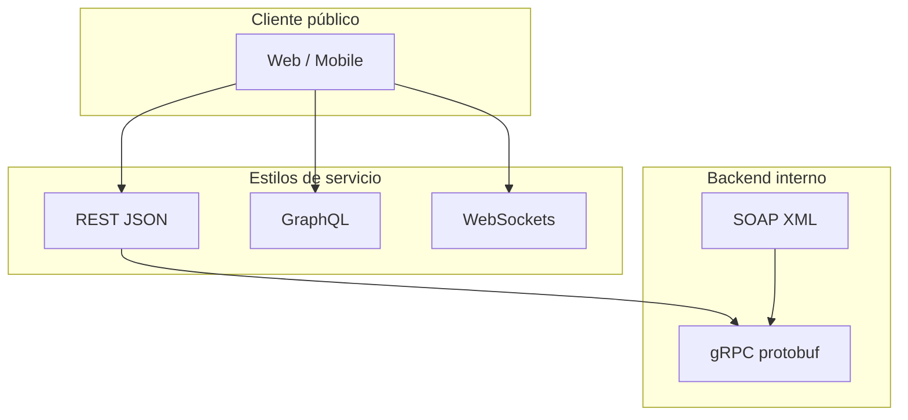
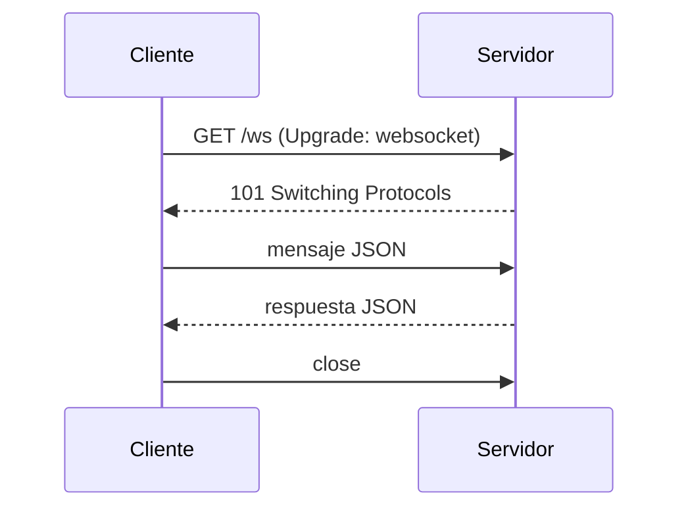

## Objetivos medibles

Al finalizar la lección el estudiante podrá:

1. Diferenciar **SOAP** (protocolo XML + WSDL) de **REST** (estilo arquitectónico sobre HTTP) y ubicar su contexto histórico y de uso.
2. Explicar **GraphQL** como lenguaje de consulta con endpoint único, resolviendo over-fetching y under-fetching de REST.
3. Describir **gRPC** (HTTP/2 + protobuf) y **WebSockets** (conexión bidireccional persistente) con sus casos de uso típicos.
4. Comparar SOAP, REST, GraphQL, gRPC y WebSockets en protocolo, formato, contrato, rendimiento y curva de aprendizaje.
5. Elegir la arquitectura adecuada según escenario: API pública web/mobile, BFF flexible, microservicios internos, tiempo real o integración bancaria legacy.

## Conceptos clave

- **SOAP (Simple Object Access Protocol):** **protocolo** de mensajería basado en **XML** (W3C). Formato estricto: envelope, header, body. Contrato en **WSDL**. Transporte: HTTP, SMTP, TCP. **WS-Security** para firmado/cifrado a nivel mensaje. Verboso; dominante en banca, gobierno, SAP, HL7.
- **REST (Representational State Transfer):** **estilo arquitectónico** (Roy Fielding, 2000), no un protocolo. URIs = recursos, métodos HTTP = verbos, códigos de estado = resultado. Principios: Stateless, Client-Server, Cacheable, Layered System, Uniform Interface, Code on Demand (opcional).
- **REST en la práctica:** JSON predominante; contrato opcional con **OpenAPI**. Ideal para APIs públicas web y móvil.
- **GraphQL:** lenguaje de consulta y runtime (Facebook 2012, open source 2015). **Un endpoint** (`POST /graphql`); el cliente define campos exactos; la respuesta **espeja** la query.
- **Over-fetching (REST):** la API devuelve más campos de los necesarios → GraphQL pide solo lo requerido.
- **Under-fetching (REST):** varias peticiones para datos relacionados → GraphQL con query anidada en una sola request.
- **GraphQL schema:** evoluciona sin versiones explícitas de URL; mutations para escritura.
- **gRPC (Google Remote Procedure Call):** framework RPC de alto rendimiento (2015). **HTTP/2** + **Protocol Buffers** (binario). Contrato en `.proto`; generación de código multi-lenguaje. Streaming bidireccional. Ideal **microservicios internos** servidor-a-servidor.
- **Protobuf:** serialización binaria 3–10× más compacta que JSON; no legible sin herramientas.
- **WebSockets:** protocolo **full-duplex** sobre TCP persistente. Handshake HTTP upgrade → **101 Switching Protocols** → mensajes en ambas direcciones sin nueva petición HTTP por mensaje.
- **WebSockets casos de uso:** chat, notificaciones push, dashboards live, juegos multijugador, trading en tiempo real.
- **Regla de selección:** API pública web/mobile → REST; frontend con datos muy específicos → GraphQL; microservicios internos alto rendimiento → gRPC; tiempo real → WebSockets; integración bancaria legacy → SOAP.

## Errores comunes

- **Llamar "REST" a cualquier API HTTP:** REST exige principios (stateless, recursos, verbos semánticos); un RPC con todo POST no es RESTful.
- **Elegir SOAP para una startup greenfield:** complejidad WSDL/XML sin beneficio si no hay requisito de partner legacy.
- **GraphQL para todo sin evaluar complejidad:** caching HTTP, rate limiting y autorización por campo añaden costo operativo.
- **gRPC expuesto directamente al navegador:** los browsers no hablan gRPC nativo; se usa gRPC-Web o gateway REST/GraphQL al frontend.
- **WebSockets cuando polling o SSE bastan:** conexiones persistentes consumen recursos; no siempre hace falta full-duplex.
- **Ignorar contrato en REST:** sin OpenAPI/documentación, la "flexibilidad" genera integraciones frágiles.
- **Confundir GraphQL con base de datos:** GraphQL es capa de API; no reemplaza SQL ni resuelve N+1 sin DataLoader u optimización.
- **Asumir que REST solo usa JSON:** puede usar XML; JSON es convención moderna dominante.
- **Comparar solo rendimiento sin contexto:** SOAP lento en red pero puede ser requisito regulatorio; gRPC brilla en LAN/datacenter.

## Casos reales

### 1. Banco: integración ACH con SOAP vs nueva app con REST

Un banco colombiano debe conectarse a la cámara de compensación vía **SOAP/XML + WS-Security** (contrato WSDL fijo, auditoría regulatoria). Paralelamente lanza app móvil de consulta de saldo para millones de usuarios.

**Decisión clave:** mantener **SOAP** en el canal interbancario legacy (cumplimiento, firma de mensajes). Exponer **REST + JSON** hacia la app móvil con API gateway que traduce internamente. No forzar SOAP al frontend ni REST al switch bancario.

### 2. Red social interna: REST lento, migración a GraphQL + WebSockets

El frontend de un panel admin hace 8 requests REST para cargar un pedido con cliente, items y productos (under-fetching). Las notificaciones de nuevos pedidos se simulan con polling cada 5 s, saturando el servidor.

**Decisión clave:** **GraphQL** en BFF con una query anidada `pedido { cliente items { producto } }`. **WebSockets** para push de eventos `nuevo_pedido` tras el handshake 101. Microservicios internos de inventario migran a **gRPC** entre pods por eficiencia protobuf.

## Ejemplos de código sugeridos

### Mensaje SOAP (XML)

<!-- code: xml -->
```xml
<soapenv:Envelope
  xmlns:soapenv="http://schemas.xmlsoap.org/soap/envelope/"
  xmlns:usr="http://api.ejemplo.com/usuarios">
  <soapenv:Header/>
  <soapenv:Body>
    <usr:ObtenerUsuario>
      <usr:id>42</usr:id>
    </usr:ObtenerUsuario>
  </soapenv:Body>
</soapenv:Envelope>
```

### Endpoints REST (recursos + verbos HTTP)

<!-- code: http -->
```http
GET    /api/v1/productos        → Lista productos
GET    /api/v1/productos/42     → Obtener producto 42
POST   /api/v1/productos        → Crear producto
PUT    /api/v1/productos/42     → Reemplazar producto 42
PATCH  /api/v1/productos/42     → Actualizar parcialmente
DELETE /api/v1/productos/42     → Eliminar producto 42
```

### Respuesta REST con HATEOAS ligero

<!-- code: json -->
```json
{
  "id": 42,
  "nombre": "Laptop Pro 15",
  "precio": 4500000,
  "stock": 12,
  "_links": {
    "self": "/api/v1/productos/42",
    "categoria": "/api/v1/categorias/3"
  }
}
```

### Query GraphQL

<!-- code: graphql -->
```graphql
query ObtenerPedido($id: ID!) {
  pedido(id: $id) {
    id
    total
    cliente {
      nombre
      email
    }
    items {
      producto {
        nombre
        precio
      }
      cantidad
    }
  }
}
```

### Respuesta GraphQL (JSON)

<!-- code: json -->
```json
{
  "data": {
    "pedido": {
      "id": "7",
      "total": 890000,
      "cliente": { "nombre": "Ana Ruiz", "email": "ana@ejemplo.com" },
      "items": [
        { "producto": { "nombre": "Teclado", "precio": 320000 }, "cantidad": 1 }
      ]
    }
  }
}
```

### Contrato gRPC (.proto)

<!-- code: protobuf -->
```protobuf
syntax = "proto3";

service ProductoService {
  rpc ObtenerProducto (ProductoRequest) returns (ProductoResponse);
}

message ProductoRequest {
  int32 id = 1;
}

message ProductoResponse {
  int32 id = 1;
  string nombre = 2;
  double precio = 3;
  int32 stock = 4;
}
```

### Cliente WebSocket (JavaScript)

<!-- code: javascript -->
```javascript
const ws = new WebSocket('wss://api.ejemplo.com/chat');
ws.onopen = () => ws.send(JSON.stringify({ tipo: 'unirse', sala: 'general' }));
ws.onmessage = (e) => console.log(JSON.parse(e.data));
```

## Ejercicios de práctica

- **tipo:** reflexion — Para una API pública de e-commerce consumida por web y Android, ¿SOAP o REST? Justifica con formato, contrato y curva de aprendizaje.
- **tipo:** reflexion — Describe un caso de over-fetching con REST y cómo GraphQL lo resolvería con una query concreta de solo 3 campos.
- **tipo:** reflexion — ¿Por qué gRPC es preferible entre microservicios en el mismo datacenter pero no se expone directo al navegador del usuario?

## Animación o visual sugerida

- **CompareTable — SOAP vs REST vs GraphQL vs gRPC vs WebSockets:** protocolo, formato, contrato, rendimiento, ideal para.
- **StepReveal — regla de selección:** tarjetas "¿API pública? → REST", "¿datos específicos? → GraphQL", etc.
- **AsciiDiagram — handshake WebSocket:** GET Upgrade → 101 → mensajes bidireccionales.
- **CompareTable — GraphQL vs REST:** over-fetching, under-fetching, versionado.

## Diagrama Mermaid (si aplica)

### Panorama de arquitecturas



### WebSocket upgrade



## Secciones TSX sugeridas

- `ObjetivosSection` — 5 objetivos medibles
- `SoapSection` — protocolo XML, WSDL, WS-Security, casos banca/DIAN
- `RestSection` — principios + endpoints HTTP + JSON con _links
- `GraphqlSection` — over/under-fetching + query + mutation
- `GrpcSection` — protobuf, HTTP/2, microservicios internos
- `WebSocketsSection` — handshake 101 + casos tiempo real + código cliente
- `ComparativaSection` — tabla general + regla de selección
- `CompruebaTuComprensionSection` — quiz integrado

## Reto integrador

**"Arquitectura de servicios para una plataforma de delivery"**

Una startup de domicilios tiene: app cliente (React Native), panel restaurante (web), riders con GPS en tiempo real, integración con pasarela bancaria SOAP legacy y 12 microservicios internos (pedidos, pagos, catálogo).

1. Asigna **SOAP, REST, GraphQL, gRPC o WebSockets** a cada canal (app cliente, panel, tracking riders, pasarela bancaria, comunicación entre microservicios). Justifica cada elección.
2. Escribe un ejemplo de **query GraphQL** que obtenga pedido + restaurante + items en una sola petición.
3. Esboza el **handshake WebSocket** para actualizar posición del rider en el mapa del cliente.
4. Indica qué formato (XML vs JSON vs protobuf) usarías en cada capa y por qué.
5. Señala un **anti-patrón**: ¿qué pasaría si expusieras gRPC directamente a la app móvil sin gateway?

**Criterio de éxito:** al menos 4 tecnologías bien justificadas, ejemplos GraphQL y WebSocket válidos, distingue público vs interno vs legacy.

## Preguntas sugeridas para quiz (5)

1. **¿Qué distingue a SOAP de REST?**
   - A) SOAP es un estilo; REST es un protocolo XML
   - B) SOAP es protocolo con mensajes XML y WSDL; REST es estilo arquitectónico sobre HTTP
   - C) Ambos usan solo JSON
   - D) REST requiere WS-Security
   - **Correcta:** B
   - **Feedback:** SOAP define formato estricto XML; REST aprovecha HTTP semántico sin ser un protocolo único.

2. **¿Qué problema de REST resuelve GraphQL con una query anidada?**
   - A) Cifrado TLS
   - B) Under-fetching (múltiples requests para datos relacionados)
   - C) Integración con SAP
   - D) Streaming binario
   - **Correcta:** B
   - **Feedback:** GraphQL permite obtener entidades relacionadas en una sola petición con la forma exacta requerida.

3. **¿Por qué gRPC suele ser más eficiente que REST+JSON en microservicios internos?**
   - A) Usa XML más pequeño
   - B) HTTP/2 y serialización protobuf binaria más compacta
   - C) No necesita contrato
   - D) Funciona solo en navegadores
   - **Correcta:** B
   - **Feedback:** Protobuf reduce tamaño y HTTP/2 permite multiplexación; ideal servidor-a-servidor.

4. **¿Qué código de estado inicia una conexión WebSocket?**
   - A) 200 OK
   - B) 404 Not Found
   - C) 101 Switching Protocols
   - D) 201 Created
   - **Correcta:** C
   - **Feedback:** Tras el handshake HTTP con Upgrade: websocket, el servidor responde 101 y la conexión persiste.

5. **¿Cuándo elegirías SOAP sobre REST?**
   - A) API pública para app móvil nueva
   - B) Chat en tiempo real
   - C) Integración con sistema bancario legacy que exige XML y WS-Security
   - D) Microservicios internos en Go
   - **Correcta:** C
   - **Feedback:** SOAP persiste donde el contrato WSDL y seguridad a nivel mensaje son requisito del ecosistema legacy.

## Referencias

- Fuente docente: `kb/education/sources/clases/programacion-orientada-sitios-web/tipos-servicios-web.md`
- Prerrequisitos: `servicios-web`, `formatos-datos`, `http-metodos-status`
- Lección siguiente: `apis`
- Relacionadas: `rest-principios`, `arquitectura-api`
- Roy Fielding — REST dissertation: https://www.ics.uci.edu/~fielding/pubs/dissertation/rest_arch_style.htm
- GraphQL — https://graphql.org/learn/
- gRPC — https://grpc.io/docs/what-is-grpc/
- MDN — WebSockets: https://developer.mozilla.org/es/docs/Web/API/WebSockets_API
