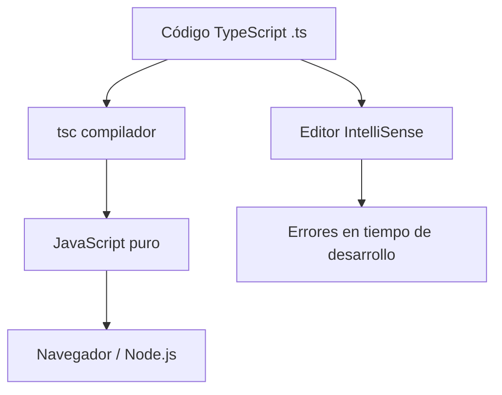
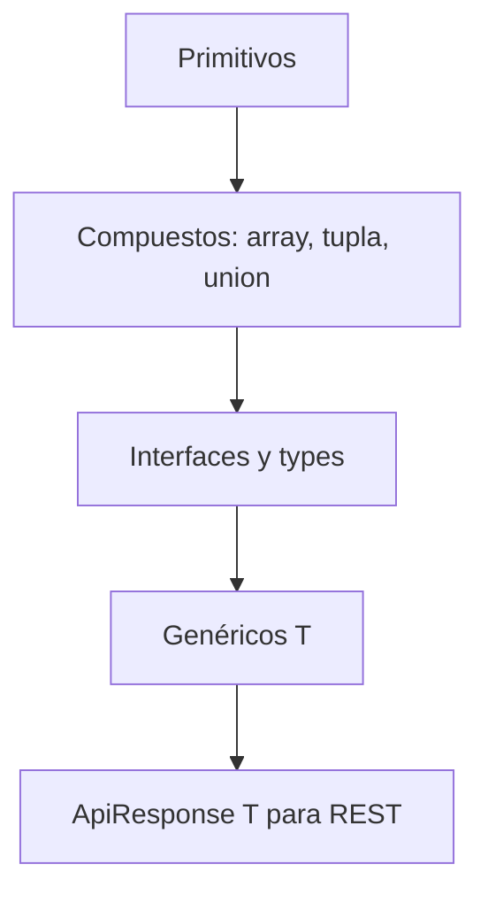

## Objetivos medibles

Al finalizar la lección el estudiante podrá:

1. Definir **TypeScript** como superset tipado de JavaScript que compila a JS y explicar el flujo **tsc → JavaScript**.
2. Comparar **JavaScript vs TypeScript** en detección de errores (runtime vs compilación) con un ejemplo de tipos incorrectos.
3. Aplicar el **sistema de tipos**: primitivos, arrays, tuplas, uniones, literales, `unknown` vs `any`.
4. Modelar datos de API con **interfaces**, **type aliases** y **enums**; elegir cuándo usar cada uno.
5. Escribir funciones y clases **genéricas** reutilizables y configurar un proyecto con **`tsconfig.json`** en modo `strict`.

## Conceptos clave

- **TypeScript:** superset tipado de JavaScript (Microsoft, open-source desde 2012). Todo JS válido es TS válido. Agrega tipos estáticos verificados en compilación; se transpila a JavaScript para ejecutarse en cualquier entorno.
- **Flujo de compilación:** código `.ts` → `tsc` (TypeScript Compiler) → JavaScript puro → navegador o Node.js.
- **Detección temprana de errores:** errores de tipo en el editor/compilación, no en producción.
- **IntelliSense y autocompletado:** el editor conoce tipos, métodos y propiedades.
- **Documentación viva:** las firmas de funciones y formas de objetos quedan explícitas en el código.
- **Refactoring seguro:** renombrar propiedades actualiza todos los usos tipados.
- **Tipos primitivos:** `string`, `number`, `boolean`, `null`, `undefined`, `symbol`, `bigint`.
- **Tipos compuestos:** arrays (`number[]`), tuplas (`[number, number]`), union types (`string | number`), literal types (`"norte" | "sur"`).
- **`any` vs `unknown`:** `any` desactiva el tipado; `unknown` exige comprobación antes de usar el valor.
- **`never`:** tipo de funciones que nunca retornan (lanzan error o bucle infinito).
- **Interfaces:** contratos para la forma de objetos; soportan `?` (opcional), `readonly`, `extends`.
- **Type aliases:** uniones, intersecciones y alias complejos; regla práctica: `interface` para objetos/clases, `type` para uniones y alias avanzados.
- **Enums:** conjuntos de constantes con nombre (`EstadoPedido.PENDIENTE`).
- **Genéricos:** código reutilizable que conserva información de tipo (`<T>`); equivalente conceptual a templates de C++ o generics de Java.
- **`tsconfig.json`:** `target`, `module`, `strict`, `outDir`, `rootDir`, `noImplicitAny`, `strictNullChecks`, `esModuleInterop`.
- **Consumo de APIs:** tipar respuestas REST (`ApiResponse<T>`) evita errores al mapear JSON del backend.

## Errores comunes

- **Usar `any` por comodidad:** anula todos los beneficios de TypeScript; preferir `unknown` y narrowing con `typeof` o type guards.
- **Confundir `interface` y `type` para todo:** no es incorrecto duplicar, pero `type` es mejor para uniones (`Producto | Error`).
- **Ignorar errores del compilador con `@ts-ignore`:** oculta bugs reales; corregir el tipo o ajustar el contrato.
- **No activar `strict`:** permite `null`/`undefined` silenciosos y `any` implícito.
- **Tipar la API como `any`:** `fetch().then(r => r.json())` sin genérico pierde el contrato con el backend REST.
- **Enums numéricos implícitos:** preferir string enums para serialización JSON predecible.
- **Olvidar que TS no valida en runtime:** los tipos desaparecen al compilar; validar respuestas externas con Zod o similar en producción.

## Casos reales

### 1. E-commerce: concatenación de precios en checkout

Un equipo escribe `calcularTotal(precio, cantidad)` en JavaScript puro. En producción, un campo de formulario envía `"4500"` (string) y el total se concatena: `"450045004500"` en lugar de multiplicar. El bug solo aparece con ciertos navegadores y datos de QA.

**Decisión clave:** migrar el módulo de carrito a TypeScript con firmas `number`; el compilador rechaza `calcularTotal("4500", 3)` antes del deploy; añadir validación runtime en el borde de la API.

### 2. Frontend enterprise: contrato roto tras cambio en API REST

Un backend cambia `precio` de `number` a `string` ("150000.00") en un endpoint de productos. El frontend Angular/React compila sin error porque tipó la respuesta como `any`. En runtime, `toLocaleString()` falla en pantallas de catálogo.

**Decisión clave:** definir `interface Producto` compartida o generada desde OpenAPI; CI falla si el contrato no coincide; TypeScript detecta el desajuste en integración continua.

## Ejemplos de código sugeridos

### Instalación y compilación

<!-- code: bash -->
```bash
# Instalar TypeScript globalmente
npm install -g typescript

# Compilar un archivo
tsc mi-archivo.ts

# Inicializar proyecto TypeScript
tsc --init   # genera tsconfig.json

# Compilar en modo watch
tsc --watch
```

### Bug en JavaScript vs detección en TypeScript

<!-- code: javascript -->
```javascript
// JavaScript — el error aparece en producción
function calcularTotal(precio, cantidad) {
  return precio * cantidad;
}
calcularTotal("4500", 3); // Retorna "450045004500"
```

<!-- code: typescript -->
```typescript
// TypeScript — el error aparece en el editor
function calcularTotal(precio: number, cantidad: number): number {
  return precio * cantidad;
}
calcularTotal("4500", 3);
// Error TS: Argument of type 'string' is not assignable to parameter of type 'number'
```

### Tipos primitivos y compuestos

<!-- code: typescript -->
```typescript
let nombre: string = "Ana";
let precios: number[] = [100, 200, 300];
let coordenada: [number, number] = [4.710, -74.072];
let id: string | number = 42;

type Direccion = "norte" | "sur" | "este" | "oeste";
let rumbo: Direccion = "norte";

let desconocido: unknown = obtenerDato();
if (typeof desconocido === "string") {
  console.log(desconocido.toUpperCase());
}
```

### Interface y respuesta de API genérica

<!-- code: typescript -->
```typescript
interface Producto {
  id: number;
  nombre: string;
  precio: number;
  descripcion?: string;
  readonly creado_en: Date;
}

type ApiResponse<T> = {
  data: T;
  status: number;
  mensaje: string;
  timestamp: string;
};

function mostrarProducto(p: Producto): string {
  return `${p.nombre} - $${p.precio.toLocaleString("es-CO")}`;
}
```

### Genéricos en repositorio

<!-- code: typescript -->
```typescript
class Repositorio<T extends { id: number }> {
  private items: T[] = [];

  agregar(item: T): void {
    this.items.push(item);
  }

  buscarPorId(id: number): T | undefined {
    return this.items.find(item => item.id === id);
  }
}

const repoProductos = new Repositorio<Producto>();
```

### tsconfig.json recomendado para proyecto web

<!-- code: json -->
```json
{
  "compilerOptions": {
    "target": "ES2020",
    "module": "ESNext",
    "moduleResolution": "bundler",
    "strict": true,
    "outDir": "./dist",
    "rootDir": "./src",
    "esModuleInterop": true,
    "skipLibCheck": true,
    "forceConsistentCasingInFileNames": true
  },
  "include": ["src/**/*"],
  "exclude": ["node_modules", "dist"]
}
```

## Ejercicios de práctica

- **tipo:** reflexion — Explica por qué TypeScript no elimina la necesidad de validar respuestas JSON del servidor en runtime. ¿Qué capa (compilación vs ejecución) cubre cada una?
- **tipo:** completar-codigo — Completa la firma: `function primerElemento<T>(arr: T[]): ___` y explica qué tipo infiere `primerElemento([1, 2, 3])`.
- **tipo:** ordenar-pasos — Ordena el flujo de desarrollo TS: (a) `tsc` genera JS, (b) escribes `.ts` con tipos, (c) el bundler sirve al navegador, (d) el editor muestra error de tipo, (e) ejecutas tests en Node.

## Animación o visual sugerida

- **StepReveal — compilación TS:** `.ts` → `tsc` → `.js` → runtime (navegador/Node).
- **CompareTable — JS vs TS:** mismo bug de tipos; columna runtime vs compilación.
- **MermaidDiagram — capas de tipado:** primitivos → compuestos → interfaces → genéricos.

## Diagrama Mermaid (si aplica)

### Flujo TypeScript → JavaScript



### Jerarquía del sistema de tipos



## Secciones TSX sugeridas

- `ObjetivosSection` — 5 objetivos medibles
- `QueEsTypeScriptSection` — definición, diagrama superset, instalación bash
- `PorQueTypeScriptSection` — comparativa JS vs TS con `TabbedCodeExample`
- `SistemaTiposSection` — primitivos, compuestos, `any` vs `unknown`
- `InterfacesTypesSection` — interfaces, type aliases, enums
- `GenericosSection` — funciones y clases genéricas, repositorio
- `ConfigTsconfigSection` — tabla de opciones + `tsconfig.json` ejemplo
- `CompruebaTuComprensionSection` — quiz integrado

## Reto integrador

**"Tipa el cliente de una API REST de pedidos"**

Un backend expone `GET /api/v1/pedidos/:id` con JSON:

```json
{
  "data": {
    "id": 1,
    "estado": "PENDIENTE",
    "items": [{ "productoId": 42, "cantidad": 2, "precioUnitario": 150000 }]
  },
  "status": 200,
  "mensaje": "OK",
  "timestamp": "2025-06-23T10:00:00Z"
}
```

1. Define `enum EstadoPedido`, `interface ItemPedido`, `interface Pedido` y `type ApiResponse<T>`.
2. Escribe `async function obtenerPedido(id: number): Promise<ApiResponse<Pedido>>` con `fetch` tipado.
3. Escribe `function calcularTotal(pedido: Pedido): number` que multiplique cantidad × precioUnitario.
4. Indica qué error detectaría TypeScript si `precioUnitario` fuera `string` en el interface.
5. Propón una opción de `tsconfig.json` crítica para este proyecto y justifica `strict: true`.

**Criterio de éxito:** sin `any`, enums string para estado, genérico en respuesta API, función de total con tipos numéricos explícitos.

## Preguntas sugeridas para quiz (5)

1. **¿Qué relación tiene TypeScript con JavaScript?**
   - A) Es un lenguaje incompatible que reemplaza JavaScript
   - B) Es un superset: todo JS válido es TS válido
   - C) Solo funciona en el navegador
   - D) No necesita compilación
   - **Correcta:** B
   - **Feedback:** TypeScript extiende JavaScript con tipos; se compila a JS con `tsc`.

2. **¿Cuándo se detecta `calcularTotal("4500", 3)` si la firma exige `number`?**
   - A) Solo en producción
   - B) En compilación o en el editor, antes de ejecutar
   - C) Nunca, TypeScript valida en runtime
   - D) Solo si usas `any`
   - **Correcta:** B
   - **Feedback:** El compilador rechaza argumentos incompatibles en tiempo de desarrollo.

3. **¿Cuál es más seguro que `any` para datos de origen desconocido?**
   - A) `never`
   - B) `unknown` con narrowing
   - C) `void`
   - D) `object` sin más comprobación
   - **Correcta:** B
   - **Feedback:** `unknown` obliga a verificar el tipo antes de usar el valor.

4. **Regla práctica: ¿cuándo preferir `type` sobre `interface`?**
   - A) Siempre para clases
   - B) Para uniones e intersecciones complejas
   - C) Solo en archivos `.js`
   - D) Nunca, `interface` reemplaza a `type`
   - **Correcta:** B
   - **Feedback:** `interface` para forma de objetos; `type` para uniones como `Producto | Error`.

5. **¿Qué hace `"strict": true` en tsconfig.json?**
   - A) Desactiva todos los tipos
   - B) Activa verificaciones estrictas (null checks, no implicit any, etc.)
   - C) Compila a ES5 obligatoriamente
   - D) Impide usar genéricos
   - **Correcta:** B
   - **Feedback:** `strict` agrupa opciones que evitan errores silenciosos de tipado.

## Referencias

- Fuente docente: `kb/education/sources/clases/programacion-orientada-sitios-web/typescript.md`
- Prerrequisito: `rest-principios`
- Lecciones relacionadas: `angular`, `react`, `frontend`, `apis`, `backend`
- TypeScript handbook: https://www.typescriptlang.org/docs/
