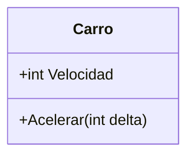
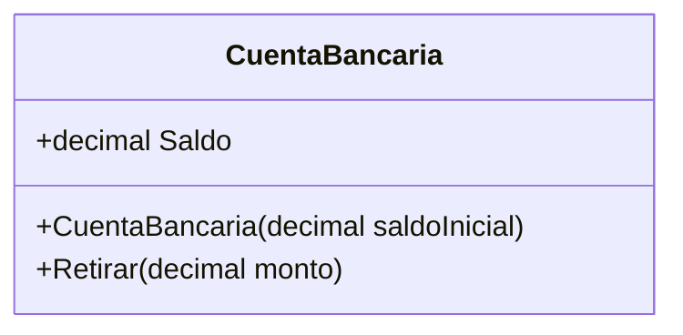
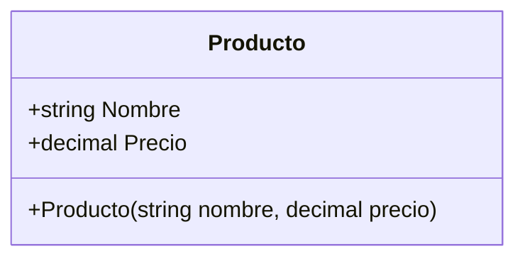
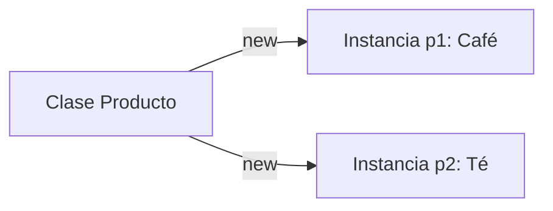
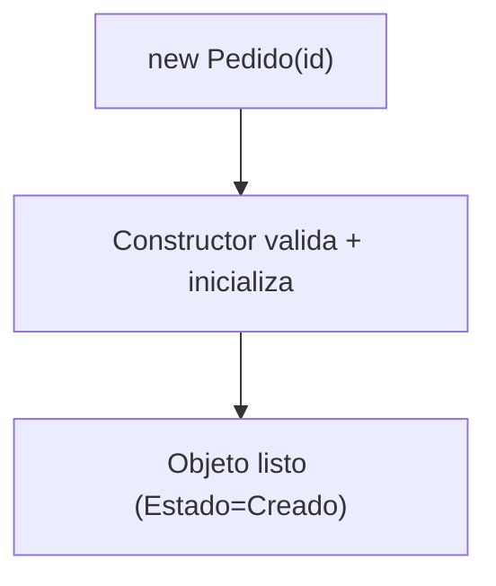

# 01. Fundamentos de POO

## 1) ¿Qué es la Programación Orientada a Objetos (POO)?

### Mapa mental

- **Modelar** el mundo (o el negocio) como “cosas” con datos + acciones.
- **Agrupar** datos y comportamiento en la misma unidad: el objeto.
- **Reutilizar** y **extender** comportamiento sin copiar y pegar.
- Mejorar **mantenibilidad**: cambios más localizados.

### Qué es

La POO es un estilo de programación donde organizas el software alrededor de **objetos**.  
Un objeto suele representar una entidad del dominio (ej. “Pedido”, “Usuario”, “Carrito”) y contiene:

- **Estado**: sus datos internos.
- **Comportamiento**: lo que puede hacer (métodos).

### Para qué sirve

- **Reducir caos**: en vez de funciones sueltas por todo lado, tienes unidades con responsabilidades claras.
- **Evitar inconsistencias**: el objeto protege sus reglas (invariantes).
- **Diseñar para el cambio**: agregar variantes (ej. nuevos métodos de pago) sin tocar todo el sistema.

### Señales de buen/mal uso

- **Aplica cuando**: hay reglas de negocio, estados válidos/invalidos, entidades que “hacen” cosas.
- **No aplica cuando**: el problema es pura transformación de datos (pipeline) y una estructura funcional simple es suficiente.

### Ejemplo vida real

Piensa en un **carro**: tiene estado (velocidad, combustible) y comportamientos (acelerar, frenar).  
No tiene sentido “sumar velocidad” desde cualquier parte sin reglas: el carro controla cómo cambia.

### Ejemplo C# (mínimo) + variante

```csharp
using System;

public class Carro
{
    public int Velocidad { get; private set; }

    public void Acelerar(int delta)
    {
        if (delta <= 0) throw new ArgumentException("delta debe ser positivo");
        Velocidad += delta;
    }
}

public class Program
{
    public static void Main()
    {
        var carro = new Carro();
        carro.Acelerar(10);
        Console.WriteLine(carro.Velocidad); // 10
    }
}
```

Variante (anti-ejemplo): permitir `set;` público rompe el control del objeto (cualquiera podría poner velocidad negativa).

### Diagrama/tabla



### Reto interactivo (3–10 min)

1. Cambia `carro.Acelerar(10)` por `carro.Acelerar(-5)`.
2. Ejecuta y observa el error.
3. Ajusta el mensaje o el tipo de excepción para que sea más claro.

Resultado esperado: el programa debe **fallar** con un mensaje que explique la regla.

### Mini-quiz

1. V/F: En POO, un objeto siempre debe exponer todos sus datos con `public set`.
2. ¿Qué define mejor a un objeto?
   - A) Solo datos
   - B) Datos + comportamiento
   - C) Solo funciones
3. ¿Cuál es un beneficio típico de POO?
   - A) Menos reglas
   - B) Menos responsabilidades
   - C) Cambios más localizados

**Respuestas**: (1) F, (2) B, (3) C

---

## 2) ¿Qué es un Objeto?

### Mapa mental

- Tiene **identidad** (es “ese” objeto).
- Tiene **estado** (datos actuales).
- Tiene **comportamiento** (métodos).

### Qué es

Un objeto es una **instancia** que vive en memoria y representa algo del dominio.  
No es “solo un paquete de datos”: también sabe hacer operaciones válidas sobre sí mismo.

### Para qué sirve

- Encapsular reglas: “solo se puede retirar si hay saldo”.
- Evitar estados inválidos: “un pedido no puede enviarse si no está pagado”.

### Señales de buen/mal uso

- **Bien**: métodos que expresan intención (`Pagar()`, `Enviar()`), no “setters” masivos.
- **Mal**: objetos anémicos (solo propiedades) + reglas dispersas en servicios gigantes.

### Ejemplo vida real

Una **tarjeta de acceso**: no cualquiera decide que “ahora es válida”. Hay reglas (fecha, permisos, bloqueo).

### Ejemplo C# (mínimo) + variante

```csharp
using System;

public class CuentaBancaria
{
    public decimal Saldo { get; private set; }

    public CuentaBancaria(decimal saldoInicial)
    {
        if (saldoInicial < 0) throw new ArgumentException("Saldo inicial inválido");
        Saldo = saldoInicial;
    }

    public void Retirar(decimal monto)
    {
        if (monto <= 0) throw new ArgumentException("Monto inválido");
        if (monto > Saldo) throw new InvalidOperationException("Fondos insuficientes");
        Saldo -= monto;
    }
}
```

Variante: agrega `Depositar(decimal monto)` y evita montos negativos.

### Diagrama/tabla



### Reto interactivo

1. Crea `var cuenta = new CuentaBancaria(50);`
2. Llama `cuenta.Retirar(80);`
3. Ajusta el mensaje de error para que explique “saldo actual” y “monto solicitado”.

Resultado esperado: excepción por fondos insuficientes.

### Mini-quiz

1. ¿Cuál es un ejemplo de comportamiento del objeto?
   - A) `Saldo`
   - B) `Retirar()`
2. V/F: Un objeto puede proteger reglas de negocio.
3. ¿Qué es “objeto anémico”?
   - A) Objeto con muchos métodos
   - B) Objeto con solo datos y sin reglas

**Respuestas**: (1) B, (2) V, (3) B

---

## 3) ¿Qué es una Clase?

### Mapa mental

- Es el **molde**: define estructura + comportamiento.
- No es el objeto: es la definición.
- Permite crear muchas instancias con `new`.

### Qué es

Una clase es una definición (tipo) que especifica:

- Qué datos tendrá el objeto (campos/propiedades).
- Qué acciones podrá hacer (métodos).

### Para qué sirve

- Reutilizar una misma definición para múltiples objetos.
- Mantener reglas en un solo lugar.

### Señales de buen/mal uso

- **Bien**: clase con una responsabilidad clara (cohesión alta).
- **Mal**: clase “Dios” (hace de todo: reglas, I/O, UI, DB, etc.).

### Ejemplo vida real

“Receta” vs “galleta”: la receta es la clase; cada galleta horneada es una instancia.

### Ejemplo C# (mínimo) + variante

```csharp
using System;

public class Producto
{
    public string Nombre { get; }
    public decimal Precio { get; }

    public Producto(string nombre, decimal precio)
    {
        if (string.IsNullOrWhiteSpace(nombre)) throw new ArgumentException("Nombre requerido");
        if (precio < 0) throw new ArgumentException("Precio inválido");
        Nombre = nombre;
        Precio = precio;
    }
}

public class Program
{
    public static void Main()
    {
        var cafe = new Producto("Café", 5.5m);
        var te = new Producto("Té", 4.0m);
        Console.WriteLine($"{cafe.Nombre} - {cafe.Precio}");
        Console.WriteLine($"{te.Nombre} - {te.Precio}");
    }
}
```

Variante: agrega un método `AplicarDescuento(decimal porcentaje)` que devuelva un nuevo precio (sin mutar).

### Diagrama/tabla



### Reto interactivo

1. Crea un `Producto` con precio negativo.
2. Ajusta la validación para que el mensaje diga: “Precio debe ser >= 0”.

### Mini-quiz

1. V/F: Una clase es lo mismo que un objeto.
2. ¿Qué keyword crea una instancia en C#?
   - A) `class`
   - B) `new`
   - C) `using`

**Respuestas**: (1) F, (2) B

---

## 4) ¿Qué es una Instancia?

### Mapa mental

- Instancia = **objeto concreto** creado desde una clase.
- Dos instancias pueden tener **estados distintos**.

### Qué es

Una instancia es un objeto específico creado a partir de una clase, por ejemplo:

```csharp
var p1 = new Producto("Café", 5.5m);
var p2 = new Producto("Té", 4.0m);
```

`p1` y `p2` son instancias diferentes.

### Para qué sirve

- Representar múltiples elementos del mismo tipo en el sistema.
- Guardarlos en colecciones, procesarlos, compararlos, etc.

### Señales de buen/mal uso

- **Bien**: crear instancias cuando realmente necesitas identidad/estado.
- **Mal**: crear instancias solo para “agrupar funciones” (si no hay estado, quizá sea un helper estático).

### Ejemplo vida real

“Usuario” (clase) vs “Ana” y “Juan” (instancias).

### Diagrama/tabla



### Reto interactivo

1. Crea una `List<Producto>` con 3 instancias.
2. Imprime los nombres en un `foreach`.

### Mini-quiz

1. V/F: Dos instancias de la misma clase comparten el mismo estado automáticamente.
2. ¿Qué relación describe mejor “clase → instancia”?
   - A) Molde → objeto
   - B) Objeto → molde

**Respuestas**: (1) F, (2) A

---

## 5) ¿Qué es un Constructor y para qué se usa?

### Mapa mental

- Se ejecuta **al crear** el objeto (`new`).
- Deja el objeto en un **estado válido**.
- Puede validar y asignar valores iniciales.

### Qué es

Un constructor es un método especial con el mismo nombre de la clase (en C#) y sin tipo de retorno, que se ejecuta cuando creas una instancia.

### Para qué sirve

- Asegurar invariantes (“un pedido nace con estado `Creado`”).
- Validar entradas (“precio no negativo”).
- Inyectar dependencias (más adelante: interfaces).

### Señales de buen/mal uso

- **Bien**: constructor valida lo esencial y deja el objeto listo para usar.
- **Mal**: constructor hace I/O (leer archivos, DB, HTTP) o lógica pesada que vuelve lenta/fragil la creación.

### Ejemplo vida real

“Encender” un dispositivo: al encender, se inicializa a un estado listo (no “a medias”).

### Ejemplo C# (mínimo) + variante

```csharp
using System;

public class Pedido
{
    public string Id { get; }
    public string Estado { get; private set; }

    public Pedido(string id)
    {
        if (string.IsNullOrWhiteSpace(id)) throw new ArgumentException("Id requerido");
        Id = id;
        Estado = "Creado";
    }

    public void Pagar()
    {
        if (Estado != "Creado") throw new InvalidOperationException("Solo se paga un pedido creado");
        Estado = "Pagado";
    }
}
```

Variante: cambia `Estado` a un `enum` para evitar strings inválidos.

### Diagrama/tabla



### Reto interactivo

1. Crea `var p = new Pedido("");`
2. Mejora el mensaje de error: debe decir qué campo falló y por qué.
3. Crea `var p2 = new Pedido("P-1");` y llama `p2.Pagar();` dos veces.

Resultado esperado: la segunda llamada debe fallar con una excepción clara.

### Mini-quiz

1. ¿Cuándo se ejecuta el constructor?
   - A) Al compilar
   - B) Al crear el objeto con `new`
2. V/F: Es buena práctica que un constructor haga una llamada HTTP.
3. ¿Cuál es un objetivo principal del constructor?
   - A) Dejar el objeto en estado válido
   - B) Imprimir logs siempre

**Respuestas**: (1) B, (2) F, (3) A
