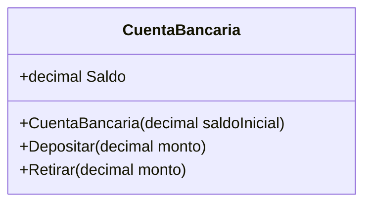
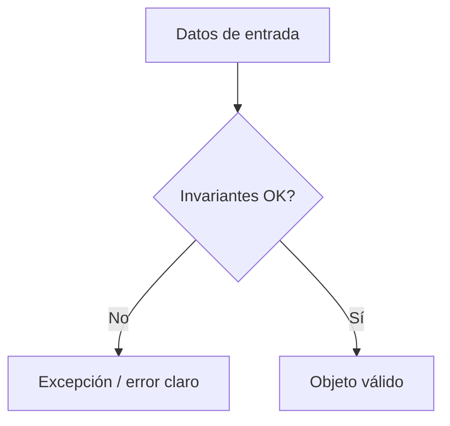

# 02. Encapsulamiento

## 1) Encapsulamiento: qué es y para qué sirve

### Mapa mental

- **Ocultar** detalles internos.
- **Exponer** una forma segura de usar el objeto.
- Proteger **invariantes** (reglas que siempre deben cumplirse).
- Reducir acoplamiento: cambias por dentro sin romper a los demás.

### Qué es

Encapsulamiento es el principio de **controlar el acceso** al estado interno de un objeto, exponiendo solo lo necesario mediante métodos/propiedades.  
La idea central: **nadie debería poder poner al objeto en un estado inválido** desde afuera.

### Para qué sirve

- Evitar estados imposibles (ej. saldo negativo sin permitir sobregiro).
- Centralizar reglas (validación en un solo lugar).
- Permitir cambios internos sin cambiar el “contrato” público.

### Señales de buen/mal uso

- **Aplica cuando**: hay reglas sobre cómo cambia el estado (casi siempre en dominio).
- **No aplica cuando**: el objeto es un DTO (solo transporte de datos) y no hay reglas.

Buen uso (señales):
- `private set` y métodos con nombres del dominio (`Retirar`, `Depositar`).
- Validación cerca del dato (no en 10 lugares).

Mal uso (señales):
- “Setters públicos” para todo.
- Validación afuera (“si saldo >= monto” repetido en cada llamada).

### Ejemplo vida real

Un **cajero automático**: tú no cambias el saldo “a mano”.  
Solo puedes pedir operaciones permitidas (retirar, consultar), y el sistema valida.

### Ejemplo C# (mínimo) + variante

```csharp
using System;

public class CuentaBancaria
{
    public decimal Saldo { get; private set; }

    public CuentaBancaria(decimal saldoInicial)
    {
        if (saldoInicial < 0) throw new ArgumentException("Saldo inicial inválido");
        Saldo = saldoInicial;
    }

    public void Depositar(decimal monto)
    {
        if (monto <= 0) throw new ArgumentException("Monto inválido");
        Saldo += monto;
    }

    public void Retirar(decimal monto)
    {
        if (monto <= 0) throw new ArgumentException("Monto inválido");
        if (monto > Saldo) throw new InvalidOperationException("Fondos insuficientes");
        Saldo -= monto;
    }
}

public class Program
{
    public static void Main()
    {
        var cuenta = new CuentaBancaria(100);
        cuenta.Retirar(30);
        Console.WriteLine(cuenta.Saldo); // 70
    }
}
```

Variante (anti-ejemplo): cambia `Saldo { get; private set; }` por `Saldo { get; set; }` y crea `cuenta.Saldo = -999;`.

### Diagrama/tabla



### Reto interactivo (3–10 min)

1. Implementa un límite diario: `LimiteDiario = 200`.
2. Cada retiro suma a `RetiradoHoy`.
3. Si excede el límite, lanza excepción.

Resultado esperado: el objeto debe impedir la operación sin que el “usuario” del objeto tenga que acordarse.

### Mini-quiz

1. V/F: Encapsular es esconder todo, sin exponer nada.
2. ¿Cuál es una señal de buen encapsulamiento?
   - A) Setters públicos para todo
   - B) Métodos que expresan intención y validan
3. V/F: El encapsulamiento ayuda a cambiar el interior sin romper a los consumidores.

**Respuestas**: (1) F, (2) B, (3) V

---

## 2) Invariantes (reglas que el objeto protege)

### Mapa mental

- Invariante = regla que **siempre** debe cumplirse.
- Se valida en el punto donde el estado cambia.

### Qué es

Una invariante es una condición que debe ser verdadera para que el objeto esté “bien”.  
Ejemplos:

- `Saldo >= 0`
- `Cantidad >= 0`
- `Estado` sigue un flujo válido (no saltos ilegales).

### Para qué sirve

- Evitar bugs por estados inválidos.
- Hacer el dominio más confiable.

### Señales de buen/mal uso

- **Bien**: invariantes se aplican en constructor y métodos mutadores.
- **Mal**: invariantes se “asumen” (y se rompen silenciosamente).

### Ejemplo vida real

Una **reserva**: no existe una reserva con “fecha de fin antes de la fecha de inicio”.

### Ejemplo C# (mínimo) + variante

```csharp
using System;

public class Reserva
{
    public DateTime Inicio { get; }
    public DateTime Fin { get; }

    public Reserva(DateTime inicio, DateTime fin)
    {
        if (fin <= inicio) throw new ArgumentException("Fin debe ser posterior a Inicio");
        Inicio = inicio;
        Fin = fin;
    }
}
```

Variante: agrega una regla “no más de 30 días” y valida en el constructor.

### Diagrama/tabla



### Reto interactivo

1. Crea una reserva con fechas invertidas.
2. Cambia el mensaje de error para que incluya ambos valores.

### Mini-quiz

1. ¿Dónde conviene validar invariantes?
   - A) En cualquier lugar, si te acuerdas
   - B) En el constructor y métodos que cambian el estado
2. V/F: Una invariante puede ser “Saldo no negativo”.

**Respuestas**: (1) B, (2) V
