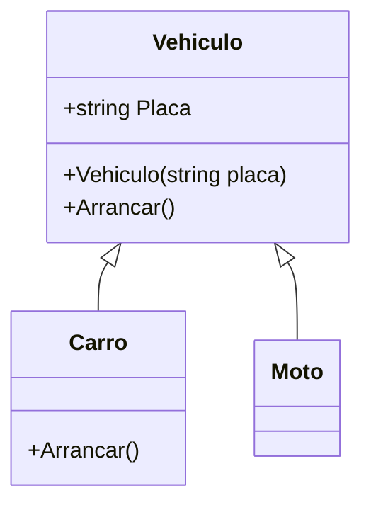
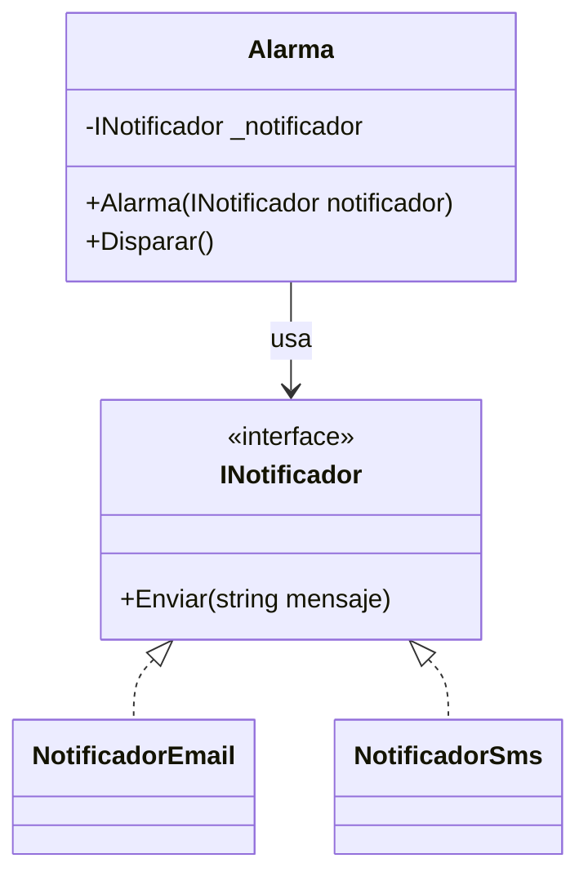

# 03. Herencia

## 1) Herencia: qué es y para qué sirve

### Mapa mental

- Herencia = relación **“es un”** (is-a).
- Reutiliza comportamiento común en una **clase base**.
- Permite especialización en **subclases**.
- Se usa con cuidado: puede aumentar acoplamiento.

### Qué es

Herencia es un mecanismo donde una clase (derivada) **hereda** estado y comportamiento de otra clase (base).  
En C#, se expresa como:

```csharp
class Hija : Padre { }
```

### Para qué sirve

- Compartir lógica común sin duplicar.
- Modelar jerarquías reales del dominio (cuando de verdad existe “es un”).
- Permitir polimorfismo (más adelante): tratar derivadas como base.

### Señales de buen/mal uso

Aplica cuando:
- La derivada puede reemplazar a la base **sin romper expectativas** (idea de sustituibilidad).
- El “es un” es natural y estable.

No aplica cuando:
- Solo quieres reutilizar código (mejor composición).
- La jerarquía se vuelve rara: “PatoElectricoConBluetoothConGPS…”.

### Ejemplo vida real

“Vehículo” → “Carro” / “Moto”.  
Ambos comparten “Arrancar”, pero tienen detalles distintos.

### Ejemplo C# (mínimo) + variante

```csharp
using System;

public class Vehiculo
{
    public string Placa { get; }

    public Vehiculo(string placa)
    {
        if (string.IsNullOrWhiteSpace(placa)) throw new ArgumentException("Placa requerida");
        Placa = placa;
    }

    public virtual void Arrancar()
    {
        Console.WriteLine("Vehículo arrancando...");
    }
}

public class Carro : Vehiculo
{
    public Carro(string placa) : base(placa) { }

    public override void Arrancar()
    {
        Console.WriteLine("Carro arrancando (inyección + encendido)...");
    }
}

public class Moto : Vehiculo
{
    public Moto(string placa) : base(placa) { }
}

public class Program
{
    public static void Main()
    {
        Vehiculo v1 = new Carro("ABC-123");
        Vehiculo v2 = new Moto("XYZ-999");

        v1.Arrancar();
        v2.Arrancar();
    }
}
```

Variante: agrega un método común `Parar()` en la base, sin override.

### Diagrama/tabla



### Reto interactivo (3–10 min)

1. Crea una nueva clase `Camion : Vehiculo`.
2. Sobrescribe `Arrancar()` con un mensaje propio.
3. Crea una lista `List<Vehiculo>` con `Carro`, `Moto`, `Camion` y llama `Arrancar()` en un `foreach`.

Resultado esperado: cada tipo imprime su propio comportamiento (si lo sobrescribe).

### Mini-quiz

1. ¿Herencia representa mejor…?
   - A) “tiene un”
   - B) “es un”
2. V/F: La herencia se usa solo para evitar duplicar código.
3. V/F: Si una clase derivada rompe las expectativas de la base, hay un problema de diseño.

**Respuestas**: (1) B, (2) F, (3) V

---

## 2) ¿Cuándo NO usar herencia? (composición como alternativa)

### Mapa mental

- “Necesito reutilizar” ≠ “necesito heredar”.
- Composición = construir objetos con otros objetos (**“tiene un”**).

### Qué es

Composición (en sentido general) significa que un objeto usa otro objeto como parte de su implementación, en vez de heredar.

### Para qué sirve

- Menos acoplamiento con jerarquías.
- Permite combinar comportamientos de forma flexible.

### Señales de buen/mal uso

Usa composición cuando:
- Quieres **variar** un comportamiento (estrategia) sin multiplicar subclases.
- El “es un” no es claro.

Herencia falla cuando:
- Cambiar la base rompe muchas derivadas.
- Necesitas “mezclar” capacidades (se vuelve explosión de clases).

### Ejemplo vida real

Un **celular** “tiene” cámara, GPS, batería. No “es” una cámara.

### Ejemplo C# (mínimo) + variante

```csharp
using System;

public interface INotificador
{
    void Enviar(string mensaje);
}

public class NotificadorEmail : INotificador
{
    public void Enviar(string mensaje) => Console.WriteLine($"Email: {mensaje}");
}

public class NotificadorSms : INotificador
{
    public void Enviar(string mensaje) => Console.WriteLine($"SMS: {mensaje}");
}

public class Alarma
{
    private readonly INotificador _notificador;

    public Alarma(INotificador notificador)
    {
        _notificador = notificador;
    }

    public void Disparar()
    {
        _notificador.Enviar("Alerta!");
    }
}

public class Program
{
    public static void Main()
    {
        var alarma1 = new Alarma(new NotificadorEmail());
        var alarma2 = new Alarma(new NotificadorSms());
        alarma1.Disparar();
        alarma2.Disparar();
    }
}
```

Variante: crea `NotificadorWhatsApp` sin tocar `Alarma`.

### Diagrama/tabla



### Reto interactivo

1. Implementa `NotificadorWhatsApp`.
2. Crea `new Alarma(new NotificadorWhatsApp())`.
3. Verifica que no tocaste la clase `Alarma`.

### Mini-quiz

1. “Tiene un” describe mejor…
   - A) Herencia
   - B) Composición
2. V/F: La composición suele reducir el acoplamiento frente a jerarquías profundas.

**Respuestas**: (1) B, (2) V
