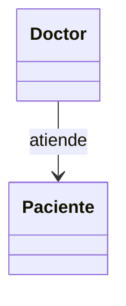
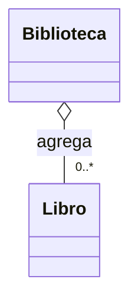
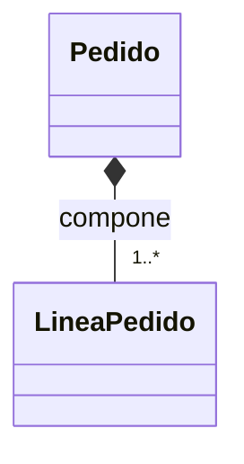

# 04. Asociación, Agregación y Composición

## 0) Antes de empezar: idea clave

En POO, muchas veces el diseño no es “heredar”, sino **relacionar** objetos.  
Estas relaciones responden a preguntas como:

- ¿Un objeto **usa** a otro?
- ¿Un objeto **tiene** a otro?
- ¿Ese “tener” implica **propiedad** y **ciclo de vida**?

---

## 1) Asociación

### Mapa mental

- Asociación = “A se relaciona con B”.
- No implica propiedad fuerte.
- Puede ser temporal (solo para una operación).

### Qué es

Una asociación es una relación general donde un objeto **conoce** o **usa** a otro objeto.  
Ejemplo típico: `Profesor` se asocia con `Curso` porque lo dicta, pero ninguno “vive dentro” del otro necesariamente.

### Para qué sirve

- Modelar colaboración entre objetos.
- Mantener responsabilidades separadas: cada uno hace lo suyo, pero trabajan juntos.

### Señales de buen/mal uso

Aplica cuando:
- El vínculo no define propiedad ni ciclo de vida.
- El objeto B puede existir sin A.

Mal uso cuando:
- Usas asociación para todo y terminas pasando 10 objetos a cada método (acoplamiento accidental).

### Ejemplo vida real

“Doctor” y “Paciente”: se relacionan en una consulta, pero ninguno “contiene” al otro.

### Ejemplo C# (mínimo) + variante

```csharp
using System;

public class Paciente
{
    public string Nombre { get; }
    public Paciente(string nombre) => Nombre = nombre;
}

public class Doctor
{
    public string Nombre { get; }
    public Doctor(string nombre) => Nombre = nombre;

    // Asociación: el doctor usa un paciente para una operación
    public void Atender(Paciente paciente)
    {
        Console.WriteLine($"{Nombre} atiende a {paciente.Nombre}");
    }
}

public class Program
{
    public static void Main()
    {
        var doctor = new Doctor("Dra. Ruiz");
        var paciente = new Paciente("Ana");
        doctor.Atender(paciente);
    }
}
```

Variante: agrega una clase `Cita` para formalizar la relación (fecha, motivo).

### Diagrama/tabla



### Reto interactivo

1. Crea `Cita` con `Doctor`, `Paciente` y `DateTime Fecha`.
2. Cambia `Atender(Paciente)` por `Atender(Cita)`.
3. Imprime: “Doctor atiende a Paciente el Fecha”.

### Mini-quiz

1. V/F: Asociación siempre significa propiedad fuerte.
2. ¿Qué describe mejor asociación?
   - A) Colaboración/uso
   - B) “Parte de” con ciclo de vida compartido

**Respuestas**: (1) F, (2) A

---

## 2) Agregación

### Mapa mental

- Agregación = “A tiene B”, pero B puede vivir sin A.
- Propiedad “débil”: relación parte-todo sin dependencia total.
- A suele mantener referencias a B.

### Qué es

La agregación es una forma de relación “todo–parte” donde el “todo” **agrupa** partes, pero las partes pueden existir por sí solas.

Ejemplo: `Equipo` agrega `Jugador`. Un jugador puede existir sin un equipo (cambia de equipo).

### Para qué sirve

- Modelar colecciones de elementos dentro de un contexto.
- Representar pertenencia sin adueñarse del ciclo de vida.

### Señales de buen/mal uso

Aplica cuando:
- El “todo” organiza/gestiona, pero no crea ni destruye la parte como su responsabilidad principal.

Mal uso cuando:
- El “todo” asume que nadie más puede usar esas partes (cuando en realidad sí).

### Ejemplo vida real

“Biblioteca” y “Libro”: la biblioteca agrupa libros, pero el libro existe como entidad independiente.

### Ejemplo C# (mínimo) + variante

```csharp
using System;
using System.Collections.Generic;

public class Libro
{
    public string Titulo { get; }
    public Libro(string titulo) => Titulo = titulo;
}

public class Biblioteca
{
    private readonly List<Libro> _libros = new();

    // Agregación: la biblioteca mantiene referencias a libros que existen por sí mismos
    public void Agregar(Libro libro) => _libros.Add(libro);

    public void Listar()
    {
        foreach (var libro in _libros)
            Console.WriteLine(libro.Titulo);
    }
}

public class Program
{
    public static void Main()
    {
        var libro1 = new Libro("Clean Code");
        var libro2 = new Libro("POO para humanos");

        var biblioteca = new Biblioteca();
        biblioteca.Agregar(libro1);
        biblioteca.Agregar(libro2);
        biblioteca.Listar();
    }
}
```

Variante: permite quitar un libro (`Quitar`) sin “destruir” el libro.

### Diagrama/tabla



### Reto interactivo

1. Implementa `Quitar(string titulo)` en `Biblioteca`.
2. Quita un libro y vuelve a listar.

Resultado esperado: el libro deja de estar en la biblioteca, pero el objeto `Libro` podría seguir existiendo en memoria si hay referencias.

### Mini-quiz

1. V/F: En agregación, la “parte” no puede existir sin el “todo”.
2. ¿Cuál ejemplo encaja mejor con agregación?
   - A) Casa–Habitación (si la casa se destruye, la habitación deja de existir)
   - B) Equipo–Jugador (un jugador puede cambiar de equipo)

**Respuestas**: (1) F, (2) B

---

## 3) Composición

### Mapa mental

- Composición = “A está hecho de B”.
- Propiedad “fuerte”: B depende del ciclo de vida de A.
- Usualmente A crea y controla a B.

### Qué es

Composición es una relación parte–todo donde la parte **no tiene sentido** (o no existe) sin el todo.  
Ejemplo: `Pedido` y `LineaPedido`. Una línea de pedido pertenece a un pedido específico.

### Para qué sirve

- Garantizar consistencia del modelo: las partes existen solo dentro del todo.
- Simplificar reglas de ciclo de vida (crear/Eliminar junto al todo).

### Señales de buen/mal uso

Aplica cuando:
- Las partes no deberían compartirse entre “todos”.
- El ciclo de vida va junto.

Mal uso cuando:
- Las partes realmente deberían poder vivir solas o compartirse (eso sería agregación/asociación).

### Ejemplo vida real

“Casa” y “Habitación”: una habitación es parte de una casa específica (en el modelo común).

### Ejemplo C# (mínimo) + variante

```csharp
using System;
using System.Collections.Generic;
using System.Linq;

public class LineaPedido
{
    public string Producto { get; }
    public int Cantidad { get; }
    public decimal PrecioUnitario { get; }

    public LineaPedido(string producto, int cantidad, decimal precioUnitario)
    {
        if (string.IsNullOrWhiteSpace(producto)) throw new ArgumentException("Producto requerido");
        if (cantidad <= 0) throw new ArgumentException("Cantidad inválida");
        if (precioUnitario < 0) throw new ArgumentException("Precio inválido");
        Producto = producto;
        Cantidad = cantidad;
        PrecioUnitario = precioUnitario;
    }

    public decimal Subtotal() => Cantidad * PrecioUnitario;
}

public class Pedido
{
    private readonly List<LineaPedido> _lineas = new();

    public void AgregarLinea(string producto, int cantidad, decimal precioUnitario)
    {
        // Composición: el Pedido crea y controla sus LineaPedido
        _lineas.Add(new LineaPedido(producto, cantidad, precioUnitario));
    }

    public decimal Total() => _lineas.Sum(l => l.Subtotal());
}

public class Program
{
    public static void Main()
    {
        var pedido = new Pedido();
        pedido.AgregarLinea("Café", 2, 5.5m);
        pedido.AgregarLinea("Pan", 1, 2.0m);
        Console.WriteLine(pedido.Total()); // 13.0
    }
}
```

Variante (anti-ejemplo): exponer `List<LineaPedido>` pública y permitir modificarla desde afuera rompe el control del `Pedido`.

### Diagrama/tabla



### Reto interactivo

1. Agrega un método `QuitarProducto(string producto)` en `Pedido`.
2. Si el producto no existe, no debe fallar (solo no hace nada).
3. Muestra el total antes y después.

### Mini-quiz

1. V/F: En composición, las partes suelen depender del ciclo de vida del todo.
2. ¿Cuál ejemplo encaja mejor con composición?
   - A) Biblioteca–Libro
   - B) Pedido–LineaPedido

**Respuestas**: (1) V, (2) B

---

## 4) Comparación rápida (asociación vs agregación vs composición)

- **Asociación**: uso/colaboración (“te llamo para algo”).
- **Agregación**: todo–parte débil (“te agrupo, pero puedes vivir sin mí”).
- **Composición**: todo–parte fuerte (“si yo no existo, tú tampoco en este modelo”).

### Reto final (elige el tipo y justifica)

Para cada caso, escribe cuál relación usarías y por qué:

1. `Universidad` y `Departamento`
2. `CarritoDeCompras` y `Producto`
3. `Factura` y `LineaFactura`
4. `Usuario` y `Sesion`

Resultado esperado: tu justificación debe mencionar **ciclo de vida** y **propiedad** cuando aplique.
