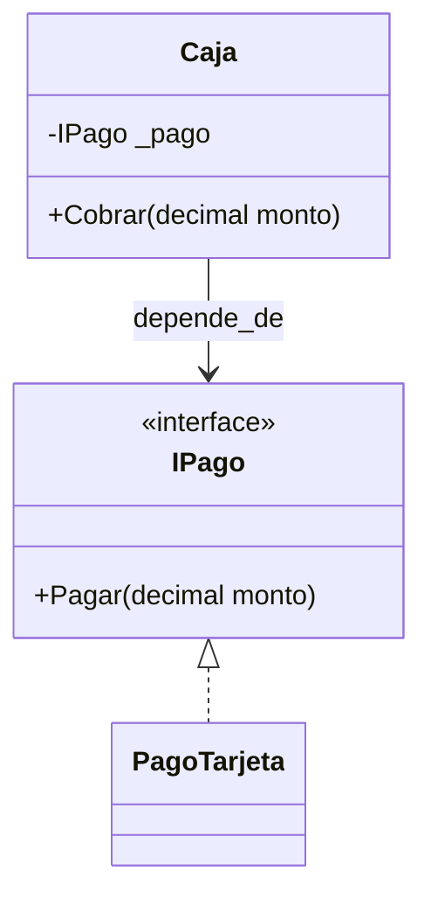
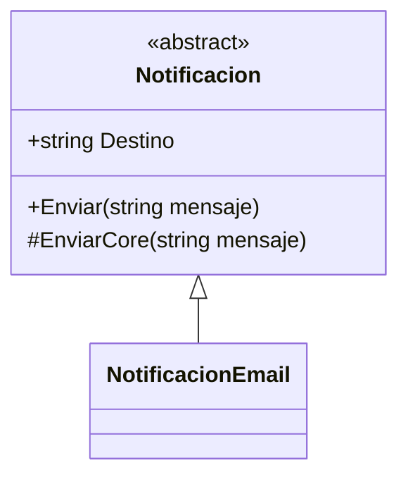
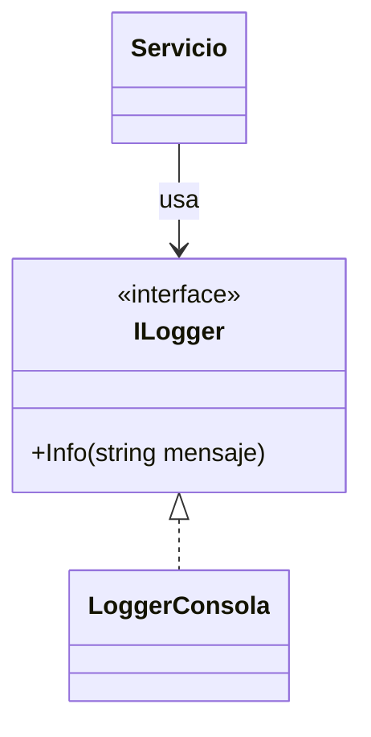
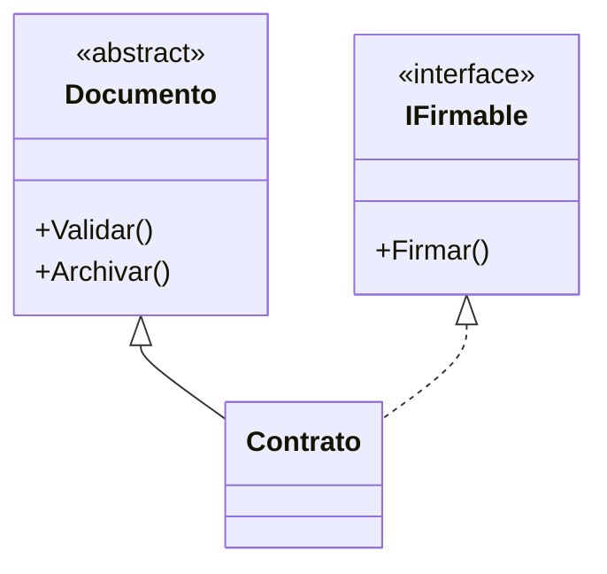

# 05. Abstracción, Clases abstractas e Interfaces

## 1) Abstracción

### Mapa mental

- Abstraer = quedarte con lo **esencial** y ocultar lo accidental.
- Definir un **contrato**: “qué se puede hacer”, no “cómo”.
- Ayuda a cambiar implementaciones sin romper al cliente.

### Qué es

Abstracción es enfocarte en las características importantes de un concepto y **omitir detalles** que no importan para el nivel de decisión actual.  
En software, suele verse como “programar contra un contrato” (interfaz o clase base) en vez de depender de una implementación concreta.

### Para qué sirve

- **Reducir complejidad**: piensas en “pagar” sin pensar aún en “tarjeta vs transferencia”.
- **Diseñar para extender**: agregas implementaciones nuevas con cambios mínimos.
- **Aislar cambios**: si cambia un proveedor, no cambias todo el sistema.

### Señales de buen/mal uso

Aplica cuando:
- Hay variaciones reales (múltiples formas válidas de hacer algo).
- El cliente necesita una capacidad, no una clase específica.

No aplica cuando:
- Solo hay una implementación y no hay señales de variación (abstracción prematura).

### Ejemplo vida real

“Enchufe” vs “electrodoméstico”: el enchufe define el contrato (conectar/energía).  
No te importa si el dispositivo por dentro es tostadora o cargador.

### Ejemplo C# (mínimo) + variante

```csharp
using System;

public interface IPago
{
    void Pagar(decimal monto);
}

public class PagoTarjeta : IPago
{
    public void Pagar(decimal monto) => Console.WriteLine($"Pagando {monto} con tarjeta");
}

public class Caja
{
    private readonly IPago _pago;

    public Caja(IPago pago)
    {
        _pago = pago;
    }

    public void Cobrar(decimal monto)
    {
        _pago.Pagar(monto);
    }
}

public class Program
{
    public static void Main()
    {
        var caja = new Caja(new PagoTarjeta());
        caja.Cobrar(50);
    }
}
```

Variante: crea `PagoTransferencia` sin tocar `Caja`.

### Diagrama/tabla



### Reto interactivo

1. Implementa `PagoTransferencia : IPago`.
2. Crea `var caja = new Caja(new PagoTransferencia());`.
3. Verifica que **no editaste** la clase `Caja`.

### Mini-quiz

1. V/F: Abstraer es agregar más detalles.
2. ¿Qué es un buen motivo para abstraer?
   - A) “Por si acaso”
   - B) Hay variaciones reales de implementación
3. V/F: Programar contra interfaces reduce acoplamiento.

**Respuestas**: (1) F, (2) B, (3) V

---

## 2) Clase abstracta (Abstract Class)

### Mapa mental

- No se instancia con `new`.
- Puede tener **implementación parcial**.
- Puede definir métodos abstractos (obligatorios) y virtuales (opcionales).

### Qué es

Una clase abstracta es una clase que sirve como base para otras clases, y puede:

- Tener código compartido.
- Forzar a las derivadas a implementar partes (`abstract`).

### Características

- No se puede crear instancia directa: `new Animal()` (si `Animal` es abstract) no compila.
- Puede tener estado y constructores.
- Puede tener métodos `abstract` (sin cuerpo) y `virtual` (con cuerpo sobrescribible).

### Para qué sirve

- Compartir comportamiento común sin duplicarlo.
- Definir un flujo común (“plantilla”) y dejar variaciones en derivadas.

### Señales de buen/mal uso

Aplica cuando:
- Hay código base real que quieres compartir.
- Quieres imponer un “esqueleto” (Template Method).

No aplica cuando:
- Solo quieres un contrato sin estado/implementación compartida (mejor interfaz).
- La jerarquía empieza a crecer sin sentido.

### Ejemplo vida real

“Formulario” abstracto: todos los formularios validan y guardan, pero cada uno valida campos específicos.

### Ejemplo C# (mínimo) + variante

```csharp
using System;

public abstract class Notificacion
{
    public string Destino { get; }

    protected Notificacion(string destino)
    {
        if (string.IsNullOrWhiteSpace(destino)) throw new ArgumentException("Destino requerido");
        Destino = destino;
    }

    public void Enviar(string mensaje)
    {
        if (string.IsNullOrWhiteSpace(mensaje)) throw new ArgumentException("Mensaje requerido");
        // Flujo común
        Console.WriteLine($"Preparando notificación para {Destino}...");
        EnviarCore(mensaje);
        Console.WriteLine("Notificación enviada.");
    }

    protected abstract void EnviarCore(string mensaje);
}

public class NotificacionEmail : Notificacion
{
    public NotificacionEmail(string destino) : base(destino) { }

    protected override void EnviarCore(string mensaje)
    {
        Console.WriteLine($"Email a {Destino}: {mensaje}");
    }
}

public class Program
{
    public static void Main()
    {
        Notificacion n = new NotificacionEmail("ana@correo.com");
        n.Enviar("Hola");
    }
}
```

Variante: agrega `NotificacionSms` (solo implementa `EnviarCore`).

### Diagrama/tabla



### Reto interactivo

1. Crea `NotificacionSms` y úsala en `Main`.
2. Haz que `Destino` del SMS tenga un formato mínimo (ej. que empiece con `+`).

### Mini-quiz

1. V/F: Una clase abstracta puede tener métodos con implementación.
2. ¿Qué keyword obliga a implementar en derivadas?
   - A) `virtual`
   - B) `abstract`
3. V/F: Puedes crear `new Notificacion(...)` si es abstract.

**Respuestas**: (1) V, (2) B, (3) F

---

## 3) Interfaces

### Mapa mental

- Interfaz = **contrato** (capacidad).
- No define “qué es”, sino “qué puede hacer”.
- Permite múltiples implementaciones.

### Qué es

Una interfaz describe un conjunto de miembros (métodos/propiedades) que una clase promete implementar.

### Para qué sirve

- Desacoplar: el consumidor depende del contrato, no de la clase concreta.
- Facilitar pruebas: puedes reemplazar implementaciones (mock/fake).
- Permitir múltiples roles: una misma clase puede implementar varias interfaces.

### Señales de buen/mal uso

Aplica cuando:
- Quieres expresar capacidades (ej. “se puede pagar”, “se puede notificar”).
- Esperas más de una implementación.

No aplica cuando:
- Creas interfaces gigantes (“IManagerDeTodo”) que nadie usa completas.

### Ejemplo vida real

“Control remoto” es un contrato: encender/apagar.  
Sirve para TV, aire, parlante… distintas implementaciones, mismo contrato.

### Ejemplo C# (mínimo) + variante

```csharp
using System;

public interface ILogger
{
    void Info(string mensaje);
}

public class LoggerConsola : ILogger
{
    public void Info(string mensaje) => Console.WriteLine($"INFO: {mensaje}");
}

public class Servicio
{
    private readonly ILogger _logger;

    public Servicio(ILogger logger) => _logger = logger;

    public void Ejecutar()
    {
        _logger.Info("Ejecutando...");
    }
}
```

Variante: crea `LoggerSilencioso : ILogger` que no imprime nada y úsalo.

### Diagrama/tabla



### Reto interactivo

1. Crea `LoggerArchivo : ILogger` (solo simula: imprime “escribiendo en archivo”).
2. Usa `Servicio` con `LoggerArchivo` sin cambiar `Servicio`.

### Mini-quiz

1. V/F: Una clase puede implementar varias interfaces.
2. ¿Qué define una interfaz?
   - A) Implementación completa
   - B) Contrato/capacidad

**Respuestas**: (1) V, (2) B

---

## 4) Clase abstracta vs Interfaz

### Mapa mental

- Abstracta: “comparto base + obligo”.
- Interfaz: “contrato de capacidad”.
- Elige según: **reuso de implementación**, **estado**, **evolución**, **multiplicidad**.

### Qué es (comparación)

- **Clase abstracta**: útil cuando hay **código y estado compartido**.
- **Interfaz**: útil cuando quieres un **contrato** y múltiples implementaciones sin herencia.

### Para qué sirve (criterios de elección)

Usa **clase abstracta** si:
- Hay implementación común importante.
- Necesitas estado/protección base.

Usa **interfaz** si:
- Solo necesitas un contrato.
- Quieres que una clase “tenga varios roles” (implementa varias interfaces).

### Señales de buen/mal uso

- **Mal**: crear abstractas sin comportamiento compartido (solo para “forzar”).
- **Mal**: interfaces enormes (rompen segregación).

### Ejemplo vida real

- Abstracta: “Documento” con flujo común (validar → firmar → archivar).
- Interfaz: “Firmable” (cualquier cosa que se pueda firmar).

### Diagrama/tabla



### Reto interactivo

1. Piensa un caso: “Reporte”, “Factura”, “Contrato”.
2. Decide: ¿abstracta, interfaz o ambas? Justifica en 3 bullets.

### Mini-quiz

1. V/F: Una interfaz es mejor cuando necesitas compartir estado.
2. ¿Cuándo conviene una clase abstracta?
   - A) Hay código compartido real
   - B) Nunca

**Respuestas**: (1) F, (2) A
