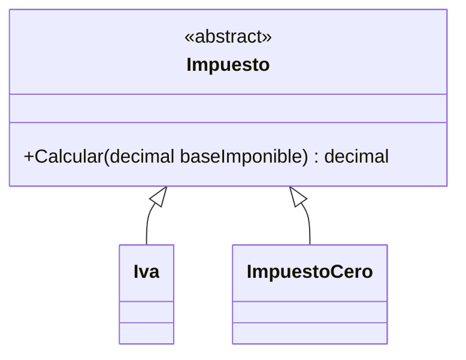

# 06. Polimorfismo

## 1) Polimorfismo: qué es y para qué sirve

### Mapa mental

- “Una misma llamada, distintos comportamientos”.
- Funciona con **interfaces** o **clases base**.
- Te permite agregar tipos nuevos sin tocar al cliente.

### Qué es

Polimorfismo es la capacidad de tratar objetos de diferentes clases como si fueran del mismo tipo (contrato), y que al invocar un método, se ejecute la implementación correspondiente al objeto real.

En C#, se ve mucho como:

- Variable del tipo `IAlgo` apuntando a `AlgoConcreto`.
- Llamas `IAlgo.Metodo()` y cada implementación responde distinto.

### Para qué sirve

- Extender sistemas sin “if gigante” por tipo.
- Escribir código cliente estable: el cliente solo conoce el contrato.
- Facilitar modularidad: plugins, estrategias, proveedores.

### Señales de buen/mal uso

Aplica cuando:
- Hay múltiples variantes del mismo “rol”.
- Quieres evitar `switch(tipo)` o `if (obj is X)` repetido.

No aplica cuando:
- Realmente solo hay un caso (abstracción innecesaria).
- Terminas con jerarquías confusas que no comparten una intención real.

### Ejemplo vida real

Un botón “Enviar” no pregunta si el destino es email o SMS: solo “enviar”.  
Cada canal lo hace a su manera.

### Ejemplo C# (mínimo) + variante (plugin de pagos)

```csharp
using System;
using System.Collections.Generic;

public interface IPasarelaPago
{
    string Nombre { get; }
    void Cobrar(decimal monto);
}

public class PasarelaTarjeta : IPasarelaPago
{
    public string Nombre => "Tarjeta";
    public void Cobrar(decimal monto) => Console.WriteLine($"[{Nombre}] cobrando {monto}");
}

public class PasarelaTransferencia : IPasarelaPago
{
    public string Nombre => "Transferencia";
    public void Cobrar(decimal monto) => Console.WriteLine($"[{Nombre}] cobrando {monto}");
}

public class Checkout
{
    private readonly IPasarelaPago _pasarela;

    public Checkout(IPasarelaPago pasarela)
    {
        _pasarela = pasarela;
    }

    public void Pagar(decimal monto)
    {
        _pasarela.Cobrar(monto);
    }
}

public class Program
{
    public static void Main()
    {
        var checkouts = new List<Checkout>
        {
            new Checkout(new PasarelaTarjeta()),
            new Checkout(new PasarelaTransferencia())
        };

        foreach (var c in checkouts)
            c.Pagar(100);
    }
}
```

Variante: agrega `PasarelaEfectivo` sin tocar `Checkout`.

### Diagrama/tabla

```mermaid
flowchart LR
  Cliente[Checkout.Pagar()] --> Contrato["IPasarelaPago.Cobrar()"]
  Contrato --> Tarjeta[PasarelaTarjeta]
  Contrato --> Transfer[PasarelaTransferencia]
```

### Reto interactivo (3–10 min)

1. Agrega `PasarelaEfectivo`.
2. Sin tocar `Checkout`, crea `new Checkout(new PasarelaEfectivo())`.
3. Verifica que el `foreach` funciona igual.

Resultado esperado: el código cliente no cambia; solo agregas una clase nueva.

### Mini-quiz

1. V/F: El polimorfismo reduce la necesidad de `if` por tipo en el cliente.
2. ¿Qué habilita polimorfismo más comúnmente en C#?
   - A) Interfaces/clases base
   - B) Variables globales
3. V/F: El cliente debe conocer todas las clases concretas para usar polimorfismo.

**Respuestas**: (1) V, (2) A, (3) F

---

## 2) Polimorfismo con clase base (virtual/override)

### Mapa mental

- Base define método `virtual`.
- Derivadas lo `override`.
- Variable base apunta a derivada.

### Qué es

Es el mismo concepto, pero usando herencia. La invocación se resuelve en tiempo de ejecución según el tipo real del objeto.

### Para qué sirve

- Reusar código base + permitir variaciones.
- Modelar familias de tipos con comportamiento común.

### Señales de buen/mal uso

- Bien: “familia real” con intención compartida.
- Mal: herencia solo por reutilizar una función.

### Ejemplo C# (mínimo) + variante

```csharp
using System;
using System.Collections.Generic;

public abstract class Impuesto
{
    public abstract decimal Calcular(decimal baseImponible);
}

public class Iva : Impuesto
{
    public override decimal Calcular(decimal baseImponible) => baseImponible * 0.19m;
}

public class ImpuestoCero : Impuesto
{
    public override decimal Calcular(decimal baseImponible) => 0m;
}

public class Program
{
    public static void Main()
    {
        var impuestos = new List<Impuesto> { new Iva(), new ImpuestoCero() };
        foreach (var imp in impuestos)
            Console.WriteLine(imp.Calcular(100)); // 19, 0
    }
}
```

Variante: agrega `ImpuestoFijo` (devuelve un valor fijo).

### Diagrama/tabla



### Reto interactivo

1. Implementa `ImpuestoFijo` con `Monto`.
2. Agrega a la lista y predice la salida antes de ejecutar.

### Mini-quiz

1. ¿Qué keyword permite sobrescribir?
   - A) `override`
   - B) `overload`
2. V/F: Una lista `List<Impuesto>` puede contener `Iva` y `ImpuestoCero`.

**Respuestas**: (1) A, (2) V
