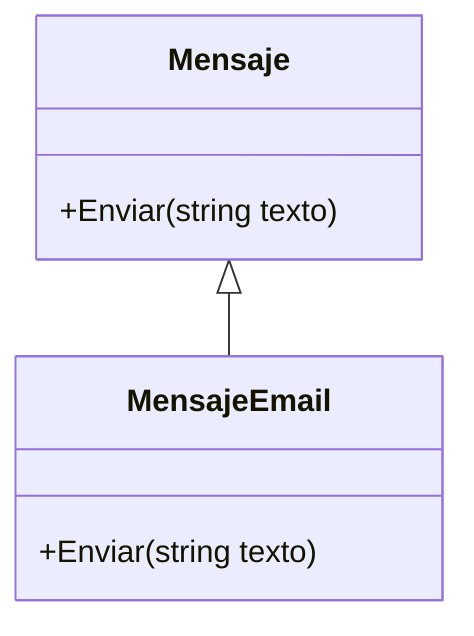
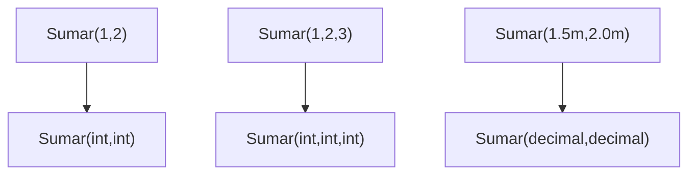
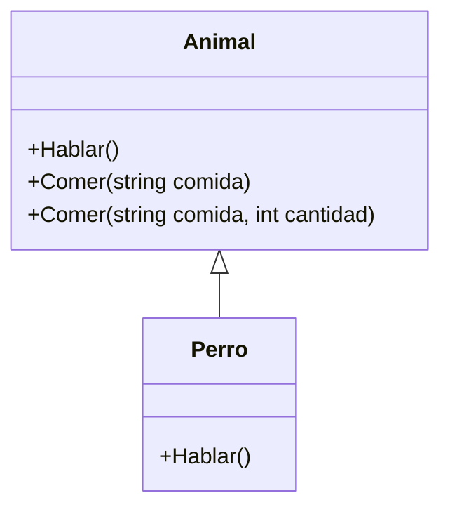

# 07. Override y Sobrecarga (Overload)

## 1) Override (sobrescritura)

### Mapa mental

- Override cambia el comportamiento de un método heredado.
- Requiere herencia + método `virtual/abstract` en la base.
- Se decide en runtime (despacho dinámico) cuando usas referencia base.

### Qué es

`override` es cuando una clase derivada reemplaza la implementación de un método definido en la clase base (marcado como `virtual` o `abstract`).

### Para qué sirve

- Especializar comportamiento manteniendo un contrato común.
- Implementar variaciones dentro de una familia de tipos.

### Señales de buen/mal uso

Buen uso:
- La derivada respeta el significado del método (no sorprende).
- Mantiene reglas y expectativas del cliente.

Mal uso:
- La derivada rompe el contrato (ej. “CalcularTotal” devuelve valores raros o lanza errores inesperados).
- Usas override para “apagar” comportamiento (por ejemplo, una derivada que no soporta algo que la base prometía).

### Ejemplo vida real

“Notificación” base: preparar → enviar.  
Email y SMS envían distinto, pero el flujo “enviar notificación” se conserva.

### Ejemplo C# (mínimo) + variante

```csharp
using System;
using System.Collections.Generic;

public class Mensaje
{
    public virtual void Enviar(string texto)
    {
        Console.WriteLine($"Enviando mensaje genérico: {texto}");
    }
}

public class MensajeEmail : Mensaje
{
    public override void Enviar(string texto)
    {
        Console.WriteLine($"Enviando EMAIL: {texto}");
    }
}

public class Program
{
    public static void Main()
    {
        Mensaje m = new MensajeEmail();
        m.Enviar("Hola"); // EMAIL
    }
}
```

Variante: agrega `MensajeSms` con su propio override.

### Diagrama/tabla



### Reto interactivo

1. Crea `MensajeSms : Mensaje`.
2. Pon ambos en `List<Mensaje>` y llama `Enviar()` en un `foreach` (el `using System.Collections.Generic;` ya está en el snippet).

### Mini-quiz

1. V/F: `override` funciona sin herencia.
2. V/F: Para poder sobrescribir, la base debe permitirlo (`virtual`/`abstract`).

**Respuestas**: (1) F, (2) V

---

## 2) Overload (sobrecarga)

### Mapa mental

- Overload = mismo nombre, distinta firma (parámetros).
- No depende de herencia.
- Se decide en compile time (resolución por firma).

### Qué es

Sobrecarga (overload) es definir varios métodos con el mismo nombre, pero con distinto número o tipo de parámetros.

### Para qué sirve

- Ofrecer formas cómodas de usar una misma operación.
- Evitar que el usuario tenga que pasar valores “dummy” o nulos.

### Señales de buen/mal uso

Buen uso:
- Las sobrecargas representan la misma intención (misma acción).
- No generan ambigüedad.

Mal uso:
- Sobrecargas que hacen cosas diferentes (confunden).
- Muchas sobrecargas sin necesidad (API difícil de aprender).

### Ejemplo vida real

“Buscar” con diferentes datos: buscar por id, por nombre, por filtro.

### Ejemplo C# (mínimo) + variante

```csharp
using System;

public class Calculadora
{
    public int Sumar(int a, int b) => a + b;
    public int Sumar(int a, int b, int c) => a + b + c;
    public decimal Sumar(decimal a, decimal b) => a + b;
}

public class Program
{
    public static void Main()
    {
        var calc = new Calculadora();
        Console.WriteLine(calc.Sumar(1, 2));       // 3
        Console.WriteLine(calc.Sumar(1, 2, 3));    // 6
        Console.WriteLine(calc.Sumar(1.5m, 2.0m)); // 3.5
    }
}
```

Variante: agrega `Sumar(params int[] valores)` y discute cuándo conviene.

### Diagrama/tabla



### Reto interactivo

1. Agrega `Sumar(params int[] valores)`.
2. Llama `Sumar(1,2,3,4)` y predice qué versión se elige.
3. Si hay ambigüedad, ajusta nombres o firmas.

### Mini-quiz

1. V/F: Sobrecarga se resuelve por nombre + parámetros.
2. V/F: Sobrecarga necesita `virtual`.

**Respuestas**: (1) V, (2) F

---

## 3) Overload vs Override (comparación práctica)

### Mapa mental

- Overload: mismo nombre, distintas firmas, mismo tipo (o en la misma clase).
- Override: mismo nombre y firma, pero en clase derivada reemplazando base.

### Comparación (lo que debes recordar)

- **Herencia**:
  - Overload: no requerida.
  - Override: requerida.
- **Firma**:
  - Overload: cambia firma.
  - Override: misma firma (debe coincidir).
- **Elección**:
  - Overload: compile time.
  - Override: runtime (si se invoca por referencia base).

### Ejemplo C# (dos conceptos en uno)

```csharp
using System;

public class Animal
{
    public virtual void Hablar() => Console.WriteLine("Sonido genérico");

    // Overload: misma clase, distinta firma
    public void Comer(string comida) => Console.WriteLine($"Come {comida}");
    public void Comer(string comida, int cantidad) => Console.WriteLine($"Come {cantidad} de {comida}");
}

public class Perro : Animal
{
    // Override: misma firma que la base
    public override void Hablar() => Console.WriteLine("Guau!");
}

public class Program
{
    public static void Main()
    {
        Animal a = new Perro();
        a.Hablar();               // Guau! (override)
        a.Comer("croquetas");     // overload 1
        a.Comer("croquetas", 2);  // overload 2
    }
}
```

### Diagrama/tabla



### Reto de predicción (3–10 min)

1. Cambia `Animal a = new Perro();` por `Perro a = new Perro();`.
2. ¿Cambia la salida de `Hablar()`? ¿Por qué?
3. Agrega un método `public new void Hablar()` en `Perro` (no `override`) y observa qué pasa.

Resultado esperado: entender la diferencia entre sobrescritura real (`override`) y ocultamiento (`new`).

### Mini-quiz

1. ¿Qué keyword se usa para sobrescribir?
   - A) `override`
   - B) `overload`
2. V/F: Overload puede existir en una clase sin herencia.
3. V/F: Override cambia la firma del método.

**Respuestas**: (1) A, (2) V, (3) F
