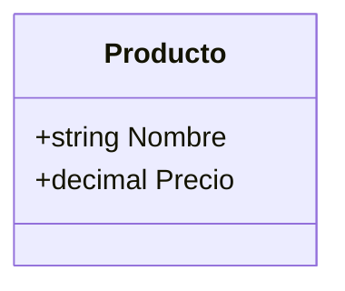
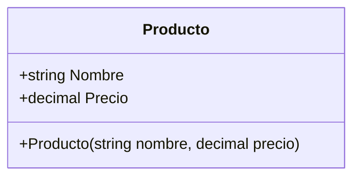
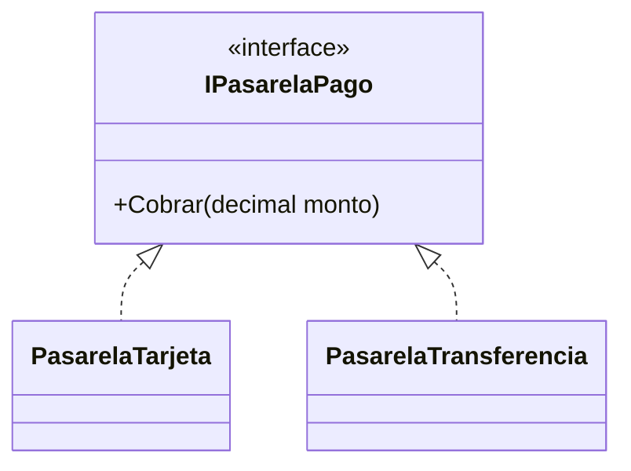
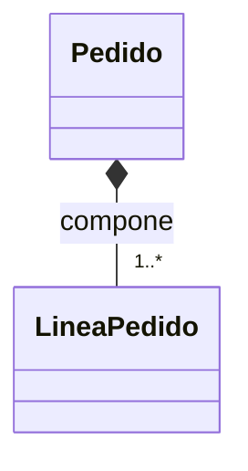
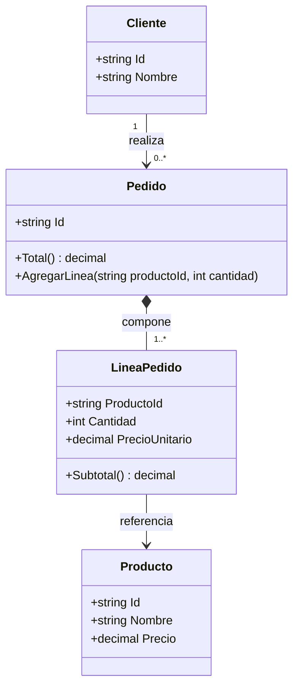

# 08. Diagramas de clases (UML básico + Mermaid)

## 1) ¿Para qué sirven los diagramas de clases?

### Mapa mental

- Te muestran **estructura**: clases y relaciones.
- Sirven para **comunicar** diseño sin meterse en código.
- Ayudan a detectar acoplamiento, responsabilidades raras y relaciones mal modeladas.

### Qué es

Un diagrama de clases (UML) es una representación de:

- Clases (nombre, atributos, métodos).
- Relaciones: herencia, implementación de interfaces, asociación/agregación/composición.

### Para qué sirve

- Alinear equipo (todos entienden lo mismo).
- Revisar diseño antes de programar.
- Documentar el modelo del dominio.

### Señales de buen/mal uso

Buen uso:
- Diagramas pequeños por módulo.
- Explican decisiones importantes (relaciones y responsabilidades).

Mal uso:
- Diagramas gigantes “para todo el sistema” sin foco.
- Diagramar al final solo para cumplir: no ayuda a pensar.

### Ejemplo vida real

Plano de una casa: no es la casa, pero te permite entender cómo se conecta todo.

### Diagrama/tabla (Mermaid)

En este curso usamos `mermaid` con `classDiagram`.

### Reto interactivo

1. Dibuja en Mermaid 3 clases: `Usuario`, `Carrito`, `Producto`.
2. Conecta `Carrito` con muchos `Producto`.
3. Decide: ¿agregación o composición? Justifica.

### Mini-quiz

1. V/F: Un diagrama de clases muestra principalmente el comportamiento (algoritmos).
2. ¿Qué muestra mejor un diagrama de clases?
   - A) Estructura y relaciones
   - B) Logs de ejecución

**Respuestas**: (1) F, (2) A

---

## 2) Elementos básicos: clase, atributos, métodos

### Mapa mental

- Clase: caja con nombre.
- Atributos: datos (propiedades/campos).
- Métodos: acciones.

### Qué es

En UML, una clase suele mostrarse con 1–3 compartimentos:

- Nombre
- Atributos
- Métodos

### Para qué sirve

- Visualizar qué “tiene” y qué “hace” una clase.
- Ver si una clase está acumulando demasiadas cosas.

### Ejemplo (tienda: Producto)

### Reto interactivo

1. Agrega a `Producto` el método `AplicarDescuento(decimal porcentaje)`.
2. Dibuja el método en el diagrama.

### Mini-quiz

1. V/F: En UML, atributos y métodos pueden representarse dentro de la clase.
2. V/F: Si un diagrama tiene demasiados miembros, puede indicar falta de cohesión.

**Respuestas**: (1) V, (2) V

---

## 3) Herencia e Interfaces en diagramas

### Mapa mental

- Herencia: “triángulo” hacia la base (en Mermaid: `<|--`).
- Interfaz: contrato (en Mermaid: `<<interface>>` + `<|..`).

### Qué es

- **Herencia**: `Base <|-- Derivada`
- **Interfaz**: `Interface <|.. ClaseImplementa`

### Para qué sirve

- Ver jerarquías y contratos de un vistazo.
- Detectar jerarquías profundas (posible problema).

### Ejemplo

### Reto interactivo

1. Dibuja una abstracta `Notificacion` y dos derivadas `NotificacionEmail`, `NotificacionSms`.
2. Marca la abstracta como `<<abstract>>`.

### Mini-quiz

1. V/F: Una interfaz se dibuja igual que una clase sin marcas.
2. ¿Qué relación describe implementación de interfaz en Mermaid?
   - A) `<|--`
   - B) `<|..`

**Respuestas**: (1) F, (2) B

---

## 4) Asociación / Agregación / Composición (recordatorio visual)

### Mapa mental

- Asociación: flecha simple.
- Agregación: rombo vacío `o--`.
- Composición: rombo lleno `*--`.

### Qué es

Son relaciones entre clases. La diferencia principal suele ser **ciclo de vida** y **propiedad** (del modelo).

### Ejemplo (pedido y líneas)

### Reto interactivo

Para cada caso, dibuja la relación correcta:

1. `Equipo` y `Jugador`
2. `Factura` y `LineaFactura`
3. `Doctor` y `Paciente` (en una consulta)

### Mini-quiz

1. ¿Cuál relación suele indicar ciclo de vida compartido?
   - A) Agregación
   - B) Composición
2. V/F: Asociación implica necesariamente que uno crea al otro.

**Respuestas**: (1) B, (2) F

---

## 5) Caso integrado: tienda / pedidos (diagrama completo)

### Mapa mental

- `Pedido` compone `LineaPedido`.
- `Pedido` se asocia con `Cliente`.
- `LineaPedido` referencia `Producto` (agregación o asociación, según modelo).

### Qué es

Este mini-modelo resume conceptos del curso y se puede mapear directo a código.

### Diagrama (Mermaid)

### Reto interactivo (3–10 min)

1. Agrega a `Pedido` un estado (`Creado`, `Pagado`, `Enviado`).
2. Dibuja el atributo `Estado`.
3. Decide: ¿vale la pena hacer una clase `EstadoPedido` o un `enum`? Justifica.

### Mini-quiz

1. V/F: Un mismo modelo puede representarse en UML y en C#.
2. ¿Qué relación usarías para `Pedido` → `LineaPedido` típicamente?
   - A) Composición
   - B) Asociación

**Respuestas**: (1) V, (2) A
