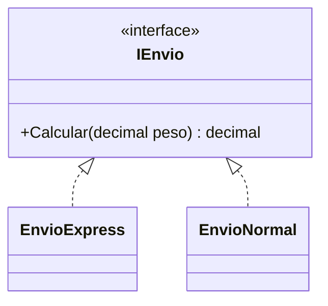
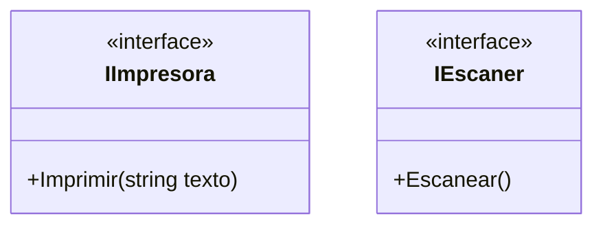
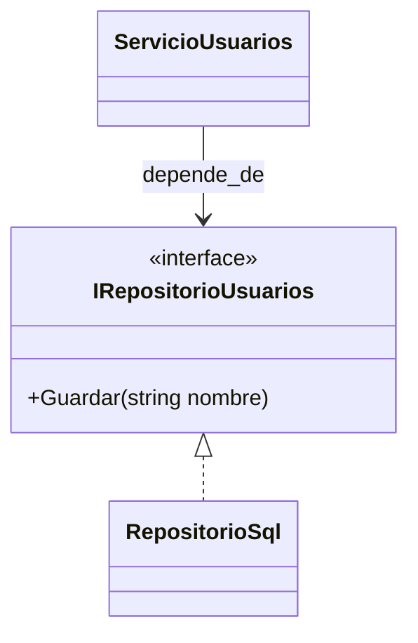

# 09. Principios SOLID

> Objetivo: entender SOLID como reglas prácticas para reducir acoplamiento, aumentar cohesión y hacer el código más fácil de cambiar.

## 1) S — Single Responsibility Principle (SRP)

### Mapa mental

- 1 clase/módulo = 1 motivo de cambio.
- Separar “orquestación” de “reglas de dominio” y de “I/O”.

### Qué es

SRP dice que una clase debe tener una sola responsabilidad principal; si cambia el motivo, cambia la clase.

### Para qué sirve

- Cambios más pequeños y seguros.
- Mejor testabilidad.
- Menos efectos colaterales.

### Señales de buen/mal uso

Bien:
- `CalculadoraImpuestos` no envía emails.

Mal:
- `PedidoService` valida, calcula, guarda en DB, envía email, genera PDF, etc.

### Ejemplo vida real

En un restaurante: cocina cocina, caja cobra, mesero atiende. Si una persona hace todo, se vuelve frágil.

### Ejemplo C# (anti-ejemplo → refactor)

Anti-ejemplo (mezcla reglas + notificación):

```csharp
using System;

public class PedidoService
{
    public void CrearYNotificar(string emailCliente, decimal total)
    {
        if (total <= 0) throw new ArgumentException("Total inválido");
        Console.WriteLine("Guardando pedido...");
        Console.WriteLine($"Enviando email a {emailCliente}...");
    }
}
```

Refactor (separar responsabilidades):

```csharp
using System;

public class CreadorPedido
{
    public void Crear(decimal total)
    {
        if (total <= 0) throw new ArgumentException("Total inválido");
        Console.WriteLine("Guardando pedido...");
    }
}

public interface INotificador
{
    void Enviar(string destino, string mensaje);
}

public class NotificadorEmail : INotificador
{
    public void Enviar(string destino, string mensaje)
        => Console.WriteLine($"Email a {destino}: {mensaje}");
}
```

### Diagrama/tabla

```mermaid
flowchart LR
  PedidoServiceMalo[PedidoService\n(hace todo)] --> Problemas[Muchos motivos de cambio]
  Creador[CreadorPedido] --> SoloCrear[Crear pedido]
  Notif[INotificador] --> SoloNotif[Notificar]
```

### Reto interactivo

1. En el refactor, crea una clase `OrquestadorPedido` que use `CreadorPedido` + `INotificador`.
2. Asegúrate de que `CreadorPedido` no dependa de email.

### Mini-quiz

1. V/F: SRP significa “una clase = un método”.
2. V/F: Si una clase cambia por motivos distintos, suele violar SRP.

**Respuestas**: (1) F, (2) V

---

## 2) O — Open/Closed Principle (OCP)

### Mapa mental

- Abierto a extensión, cerrado a modificación.
- Agregar comportamiento nuevo sin editar el cliente.

### Qué es

OCP recomienda diseñar para poder añadir nuevas variantes sin modificar código existente (especialmente el cliente).

### Para qué sirve

- Menos riesgo al agregar features.
- Menos conflictos en equipo (menos archivos tocados).

### Señales de buen/mal uso

Mal:
- `switch` por tipo en 10 lugares.

Bien:
- Interfaz + nuevas clases implementan comportamiento.

### Ejemplo vida real

Un tomacorriente: agregas un dispositivo nuevo y no modificas la pared.

### Ejemplo C# (anti-ejemplo → refactor)

Anti-ejemplo:

```csharp
using System;

public class CalculadoraEnvio
{
    public decimal Calcular(string tipo, decimal peso)
    {
        return tipo switch
        {
            "express" => peso * 10,
            "normal" => peso * 5,
            _ => throw new ArgumentException("Tipo inválido")
        };
    }
}
```

Refactor:

```csharp
using System;

public interface IEnvio
{
    decimal Calcular(decimal peso);
}

public class EnvioExpress : IEnvio
{
    public decimal Calcular(decimal peso) => peso * 10;
}

public class EnvioNormal : IEnvio
{
    public decimal Calcular(decimal peso) => peso * 5;
}
```

### Diagrama/tabla



### Reto interactivo

1. Implementa `EnvioGratis` (si `peso <= 1`, cuesta 0; si no, cuesta 3).
2. Agrégalo sin tocar las clases existentes.

### Mini-quiz

1. V/F: OCP prohíbe modificar cualquier archivo.
2. ¿Qué suele ayudar a OCP?
   - A) `switch` por tipo
   - B) Contratos (interfaces) + implementaciones

**Respuestas**: (1) F, (2) B

---

## 3) L — Liskov Substitution Principle (LSP)

### Mapa mental

- Una derivada debe poder reemplazar a la base sin “sorpresas”.
- No debilitar precondiciones, no romper postcondiciones.

### Qué es

LSP dice que si tu código funciona con una clase base, debe seguir funcionando igual con cualquier subclase, sin comportamientos inesperados.

### Para qué sirve

- Evitar jerarquías peligrosas.
- Mantener polimorfismo real.

### Señales de buen/mal uso

Mal:
- Derivada lanza excepción en un método que la base promete.
- Derivada cambia el significado del método.

Bien:
- Derivadas cumplen el contrato y no sorprenden.

### Ejemplo vida real

Si un “vehículo” promete “arrancar”, no debería existir un subtipo “vehículo” que no pueda arrancar.

### Ejemplo C# (anti-ejemplo)

```csharp
using System;

public class Ave
{
    public virtual void Volar() => Console.WriteLine("Volando");
}

public class Pinguino : Ave
{
    public override void Volar()
        => throw new InvalidOperationException("No puedo volar");
}
```

Mejor diseño: extraer una interfaz `IVolador` para aves que vuelan, en vez de forzar herencia.

### Diagrama/tabla

```mermaid
flowchart TD
  Base[Ave.Volar()] --> Expect[Cliente espera que siempre funcione]
  Sub[Pinguino.Volar()] --> Break[Rompe expectativa]
```

### Reto interactivo

1. Rediseña: crea `IAve` y `IVolador` (o clases separadas).
2. Haz que `Pinguino` no implemente “volar”.

### Mini-quiz

1. V/F: Si una subclase lanza excepciones nuevas “porque sí”, puede violar LSP.
2. V/F: LSP trata de mantener contratos consistentes en herencia.

**Respuestas**: (1) V, (2) V

---

## 4) I — Interface Segregation Principle (ISP)

### Mapa mental

- Interfaces pequeñas y específicas.
- No obligar a implementar métodos que no se usan.

### Qué es

ISP dice que es mejor tener varias interfaces pequeñas que una interfaz grande que fuerza implementaciones innecesarias.

### Para qué sirve

- Menos código “vacío”.
- Menos dependencias innecesarias.
- Contratos más claros.

### Señales de buen/mal uso

Mal:
- `IWorker` con `Trabajar()`, `Cocinar()`, `Conducir()`, `Programar()`.

Bien:
- `ICocinero`, `IConductor`, `IProgramador` separados.

### Ejemplo vida real

No todos los empleados deben tener “licencia de conducir” solo porque algunos la necesitan.

### Ejemplo C# (anti-ejemplo → refactor)

Anti-ejemplo:

```csharp
public interface IImpresoraMultiuso
{
    void Imprimir(string texto);
    void Escanear();
    void Faxear();
}
```

Refactor:

```csharp
public interface IImpresora
{
    void Imprimir(string texto);
}

public interface IEscaner
{
    void Escanear();
}
```

### Diagrama/tabla



### Reto interactivo

1. Crea una clase `ImpresoraBasica` que solo imprima.
2. Crea `ImpresoraTodoEnUno` que implemente ambas interfaces.

### Mini-quiz

1. V/F: ISP sugiere interfaces grandes para “futuro”.
2. ¿Qué es mejor según ISP?
   - A) Una interfaz gigante
   - B) Varias interfaces por rol

**Respuestas**: (1) F, (2) B

---

## 5) D — Dependency Inversion Principle (DIP)

### Mapa mental

- Alto nivel no depende de bajo nivel.
- Ambos dependen de abstracciones.
- Inyección de dependencias (constructor) es una forma común.

### Qué es

DIP dice que los módulos importantes (alto nivel) no deberían depender de detalles concretos, sino de contratos (interfaces).  
Los detalles implementan esos contratos.

### Para qué sirve

- Cambiar implementación (DB, proveedor, API) sin reescribir lógica de negocio.
- Facilitar pruebas.

### Señales de buen/mal uso

Mal:
- `new SqlRepositorio()` dentro de la lógica de negocio.

Bien:
- `IRepositorio` inyectado, implementación concreta al borde.

### Ejemplo vida real

Una empresa no cambia su proceso interno por cada marca de impresora; define un estándar (contrato).

### Ejemplo C# (anti-ejemplo → refactor)

Anti-ejemplo:

```csharp
using System;

public class ServicioUsuarios
{
    private readonly RepositorioSql _repo = new RepositorioSql();

    public void Crear(string nombre)
    {
        _repo.Guardar(nombre);
        Console.WriteLine("Usuario creado");
    }
}

public class RepositorioSql
{
    public void Guardar(string nombre) { /* simulado */ }
}
```

Refactor:

```csharp
using System;

public interface IRepositorioUsuarios
{
    void Guardar(string nombre);
}

public class RepositorioSql : IRepositorioUsuarios
{
    public void Guardar(string nombre) { /* simulado */ }
}

public class ServicioUsuarios
{
    private readonly IRepositorioUsuarios _repo;

    public ServicioUsuarios(IRepositorioUsuarios repo)
    {
        _repo = repo;
    }

    public void Crear(string nombre)
    {
        _repo.Guardar(nombre);
        Console.WriteLine("Usuario creado");
    }
}
```

### Diagrama/tabla



### Reto interactivo

1. Crea `RepositorioMemoria : IRepositorioUsuarios` que guarde en una lista.
2. Usa `ServicioUsuarios` con `RepositorioMemoria`.

### Mini-quiz

1. V/F: DIP recomienda depender de clases concretas para “simplicidad”.
2. V/F: Inyectar interfaces suele ayudar a probar.

**Respuestas**: (1) F, (2) V

---

## Mini-quiz final (repaso SOLID)

1. ¿Qué principio se rompe más cuando hay una clase que “hace de todo”?
2. ¿Qué principio te ayuda a agregar un nuevo método de envío sin tocar 10 archivos?
3. V/F: ISP prefiere interfaces pequeñas.

**Respuestas**: (1) SRP, (2) OCP, (3) V
