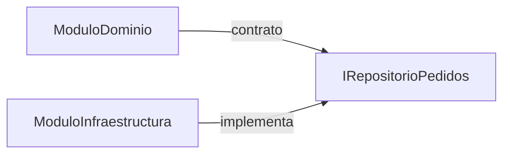
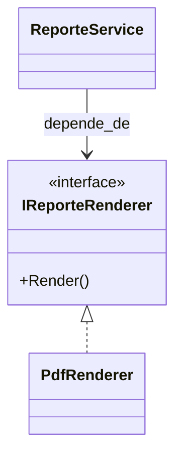

# 10. Modularidad, Cohesión y Acoplamiento

## 1) Modularidad

### Mapa mental

- Módulo = parte del sistema con un propósito claro.
- Define límites: “qué entra” y “qué sale” (API).
- Cambiar un módulo debería impactar poco en otros.

### Qué es

Modularidad es organizar el sistema en piezas (módulos) con responsabilidades claras y límites bien definidos.

### Para qué sirve

- Trabajar en paralelo (equipo).
- Reducir impactos de cambios.
- Reusar componentes.

### Señales de buen/mal uso

Bien:
- Módulos con API clara y dependencias mínimas.

Mal:
- Todo importa todo (“spaghetti”).
- “Módulos” que en realidad son carpetas sin límites.

### Ejemplo vida real

En una ciudad: agua, energía, transporte son sistemas (módulos) con interfaces claras (conexiones).

### Ejemplo C# (mínimo) + variante

Ejemplo conceptual: separar dominio de infraestructura mediante interfaces.

```csharp
public interface IRepositorioPedidos
{
    void Guardar(string pedidoId);
}

public class ServicioPedidos
{
    private readonly IRepositorioPedidos _repo;
    public ServicioPedidos(IRepositorioPedidos repo) => _repo = repo;

    public void Crear(string pedidoId)
    {
        _repo.Guardar(pedidoId);
    }
}
```

Variante: implementa `RepositorioPedidosMemoria` sin cambiar `ServicioPedidos`.

### Diagrama/tabla



### Reto interactivo (3–10 min)

1. Crea `RepositorioPedidosMemoria` y úsalo con `ServicioPedidos`.
2. Luego crea `RepositorioPedidosSql` (simulado) y cámbialo sin tocar `ServicioPedidos`.

### Mini-quiz

1. V/F: Modularidad significa “muchas carpetas”.
2. ¿Qué ayuda a modularidad?
   - A) Interfaces y límites claros
   - B) Importar cualquier cosa desde cualquier parte

**Respuestas**: (1) F, (2) A

---

## 2) Cohesión

### Mapa mental

- Cohesión = qué tan relacionadas están las responsabilidades dentro de un módulo/clase.
- Alta cohesión: todo apunta al mismo objetivo.
- Baja cohesión: mezcla de temas.

### Qué es

Cohesión mide si lo que está dentro de una clase/módulo “pertenece” junto.  
Una clase con alta cohesión es más fácil de entender y cambiar.

### Para qué sirve

- Menos bugs por efectos colaterales.
- Mejor mantenimiento.
- Mejor diseño del dominio (nombres y responsabilidades más claros).

### Señales de buen/mal uso

Alta cohesión:
- Métodos y datos trabajan sobre la misma idea (ej. `Pedido`: total, líneas, estado).

Baja cohesión:
- Clase con métodos de “usuarios”, “pagos”, “reportes”, “logs”.

### Ejemplo vida real

Una caja de herramientas: si metes comida, cables, papeles y tornillos en la misma caja, nadie encuentra nada.

### Ejemplo C# (anti-ejemplo → mejora)

Anti-ejemplo:

```csharp
public class Utilidades
{
    public string FormatearNombre(string nombre) => nombre.Trim().ToUpperInvariant();
    public decimal CalcularImpuesto(decimal valor) => valor * 0.19m;
    public void EnviarEmail(string destino) { }
}
```

Mejora: separar por responsabilidad (`FormateoTexto`, `CalculadoraImpuestos`, `NotificadorEmail`).

### Diagrama/tabla

```mermaid
flowchart TD
  Baja[BajaCohesion\n(Utilidades)] --> Mezcla[Mezcla de responsabilidades]
  Alta1[FormateoTexto] --> SoloTexto[Texto]
  Alta2[CalculadoraImpuestos] --> SoloImpuestos[Impuestos]
  Alta3[NotificadorEmail] --> SoloNotif[Notificación]
```

### Reto interactivo

1. Identifica 3 responsabilidades en `Utilidades`.
2. Divide en 3 clases y nómbralas.

### Mini-quiz

1. V/F: Alta cohesión suele mejorar legibilidad.
2. V/F: Una “clase dios” suele tener baja cohesión.

**Respuestas**: (1) V, (2) V

---

## 3) Acoplamiento (Coupling)

### Mapa mental

- Acoplamiento = cuánto depende una parte de otra.
- Bajo acoplamiento: cambios no se propagan.
- Alto acoplamiento: tocar algo rompe muchas cosas.

### Qué es

Acoplamiento mide la fuerza de dependencia entre módulos/clases.  
En general: queremos **bajo acoplamiento** para poder cambiar piezas sin reescribir el sistema.

### Para qué sirve

- Facilitar cambios y migraciones.
- Mejor testabilidad.
- Menos errores por dependencia oculta.

### Señales de buen/mal uso

Alto acoplamiento:
- `new` de concretos por todas partes.
- Uso directo de detalles (DB, HTTP) dentro de reglas de negocio.

Bajo acoplamiento:
- Dependencias por contratos.
- Separación de capas (dominio no conoce infraestructura).

### Ejemplo vida real

Si tu casa depende de una sola marca de tornillos “especiales”, cada reparación es un problema.

### Ejemplo C# (alto → bajo acoplamiento)

Alto acoplamiento:

```csharp
public class ReporteService
{
    private readonly PdfGenerator _pdf = new PdfGenerator();
    public void Generar() => _pdf.CrearPdf();
}

public class PdfGenerator
{
    public void CrearPdf() { }
}
```

Bajo acoplamiento:

```csharp
public interface IReporteRenderer
{
    void Render();
}

public class PdfRenderer : IReporteRenderer
{
    public void Render() { }
}

public class ReporteService
{
    private readonly IReporteRenderer _renderer;
    public ReporteService(IReporteRenderer renderer) => _renderer = renderer;
    public void Generar() => _renderer.Render();
}
```

### Diagrama/tabla



### Reto interactivo

1. Crea `HtmlRenderer : IReporteRenderer`.
2. Cambia la instancia inyectada y verifica que `ReporteService` no cambia.

### Mini-quiz

1. V/F: “new Concreto()” en la lógica de negocio suele aumentar acoplamiento.
2. ¿Qué suele reducir acoplamiento?
   - A) Depender de interfaces
   - B) Depender de clases concretas

**Respuestas**: (1) V, (2) A

---

## 4) Checklist rápido (práctico)

- ¿Esta clase tiene **un** motivo principal de cambio?
- ¿Puedo agregar una variante sin editar el cliente (OCP)?
- ¿Estoy dependiendo de **detalles** o de **contratos** (DIP)?
- ¿Mi interfaz es pequeña y útil (ISP)?
- ¿Mis clases están enfocadas (cohesión) y con pocas dependencias (acoplamiento)?

### Reto final (reorganiza un mini-sistema)

Tienes estas responsabilidades mezcladas en un solo archivo:

- Calcular total de compra
- Aplicar descuento
- Guardar pedido
- Enviar notificación
- Generar reporte

Actividad:

1. Propón 4–6 clases/módulos con nombres claros.
2. Define 2–3 interfaces.
3. Dibuja el diagrama de dependencias (Mermaid) con flechas.

Resultado esperado: el “dominio” (cálculos/reglas) no depende de “infra” (guardar, notificar, reportar).
