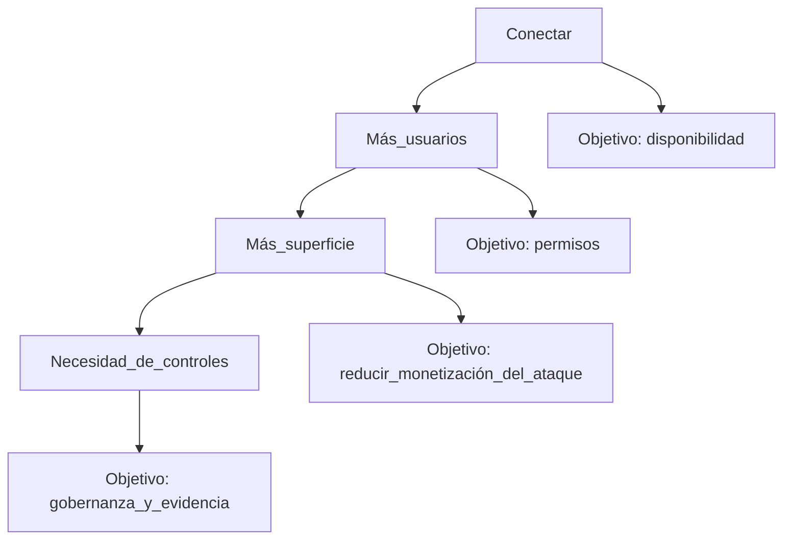

# Historia de redes y seguridad informática: evolución e importancia

## Objetivos de aprendizaje

- Narrar 4 hitos históricos que cambiaron la forma de atacar/defender sistemas.
- Diferenciar “seguridad por oscuridad” vs “seguridad por diseño” con un ejemplo.
- Explicar por qué la seguridad es un proceso (no un producto) en 3 frases.
- Reconocer 5 señales de que una app creció sin considerar seguridad.
- Relacionar un incidente famoso (sin nombres) con CIA + Autenticidad (qué se rompió).

## Prerrequisitos

Saber qué es un servidor, un cliente, una red y una aplicación web. No necesitas experiencia previa en hacking.

## Mapa mental (vista rápida)

Piensa en la historia como una carrera: primero conectamos computadores “para compartir”, luego aparecieron atacantes “por curiosidad”, después el delito “por dinero”, y finalmente la defensa “por diseño y regulación”. Cada salto de conectividad creó un salto de riesgo.

## Qué es y por qué importa

La seguridad informática nació cuando los sistemas dejaron de estar aislados. Al conectar redes, cualquier error se volvió reproducible a escala. En aplicaciones, eso significa que un fallo pequeño puede convertirse en fuga masiva de datos, fraude o interrupción del servicio. Entender la evolución te ayuda a no repetir errores: la mayoría de incidentes actuales son “viejos problemas” en “nuevos contextos”.

## Evolución en 4 etapas (muy resumida)

### Etapa 1 — Conectar para compartir

El objetivo era disponibilidad: que el sistema “funcione” y que la información viaje. La seguridad era secundaria porque el entorno era pequeño y de confianza.

### Etapa 2 — Curiosidad y primeras intrusiones

Cuando más personas obtuvieron acceso, aparecieron intrusiones por exploración. Se hizo evidente que “tener acceso” no es lo mismo que “tener permiso”.

### Etapa 3 — Industrialización del ataque

El ataque se volvió negocio. Se automatizó: campañas masivas, explotación repetible, robo de credenciales y monetización. Aquí nace la necesidad de controles sistemáticos.

### Etapa 4 — Seguridad por diseño y gobernanza

Las organizaciones empezaron a definir procesos: políticas, gestión de riesgos, controles y auditoría. La pregunta cambió de “¿me hackearon?” a “¿qué tan preparado estoy y cómo lo demuestro?”.

## Señales de una aplicación que creció sin seguridad

- Credenciales “quemadas” dentro del código o archivos compartidos.
- Errores que muestran detalles internos (rutas, consultas, stack traces) al usuario.
- Logs inexistentes o, peor, logs con datos sensibles completos.
- Cambios directos en producción sin revisión ni pruebas.
- Autenticación “a medias”: sesiones inconsistentes, tokens sin expiración o cookies sin banderas de seguridad.

## Ejemplo real (historia)

Historia: “La app que creció demasiado rápido”. Un equipo lanza una plataforma de reservas. Al principio eran 200 usuarios y un solo servidor. Se prioriza velocidad: contraseñas simples, un panel admin sin segundo factor, y mensajes de error detallados “para depurar”. Dos años después llegan 50.000 usuarios y proveedores. Un atacante no necesita romper nada sofisticado: aprovecha una contraseña reutilizada en el panel admin, extrae la base de datos y publica capturas. El daño no fue solo técnico: soporte colapsa, hay pérdida de confianza, y la empresa debe explicar por qué no tenía controles básicos.

## Ejemplo técnico (qué observarías)

En un incidente así, verías accesos administrativos en horarios inusuales, exportaciones masivas, cambios rápidos de permisos y picos de consultas. La lección: si no registras eventos críticos y no limitas impacto, te enteras tarde y con poca evidencia.

```bash
# Buscar accesos a rutas administrativas y picos por IP (ejemplo conceptual).
# Ajusta rutas/archivos según tu servidor (nginx/apache/app).
grep -E "/admin|/login" /var/log/nginx/access.log | tail -n 50
awk '{print $1}' /var/log/nginx/access.log | sort | uniq -c | sort -nr | head -n 10
```

```http
# Patrón de requests repetitivas a un endpoint sensible (ejemplo conceptual)
GET /admin/export?format=csv HTTP/1.1
Host: ejemplo.com
User-Agent: Mozilla/5.0

GET /admin/export?format=csv HTTP/1.1
Host: ejemplo.com
User-Agent: Mozilla/5.0
```

## Diagrama (Mermaid)

### De conectividad a riesgo



## Reto interactivo (sin código)

Escribe 6 líneas: (1) cuál es el activo principal de una app que uses a diario, (2) qué podría pasar si se filtra, (3) qué podría pasar si se cae 1 día, (4) qué evidencia te gustaría tener en logs si ocurre un fraude, (5) qué control “barato” aplicarías hoy, (6) qué control “caro” planearías para después.

## Mini-quiz (5 preguntas)

1. V/F: La seguridad es un estado final que se alcanza cuando ya no hay vulnerabilidades.
2. V/F: Al aumentar usuarios y conexiones, aumenta la superficie de ataque.
3. ¿Cuál es una señal típica de una app sin seguridad por diseño?
4. La “industrialización del ataque” se caracteriza principalmente por:
5. En 1 frase, explica por qué la seguridad es un proceso y no un producto.

- A) Errores genéricos al usuario
- B) Credenciales en el repositorio
- C) Revisiones de cambios antes de producción

- A) Ataques manuales aislados
- B) Automatización y escala
- C) Redes desconectadas

Respuestas: (1) F, (2) V, (3) B, (4) B, (5) Respuesta esperada: debe mencionar mejora continua o ciclo constante (cambios, nuevas amenazas, mantenimiento), no un “checklist único”.
