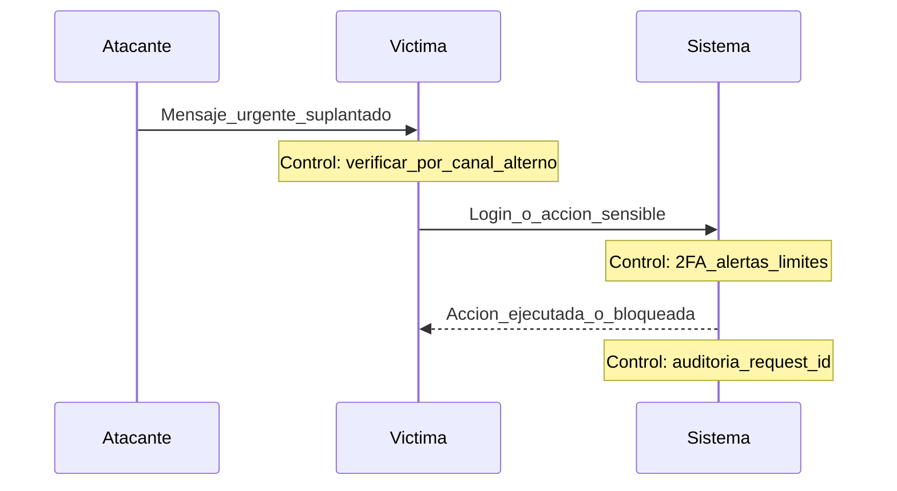

# Qué es un hacker, canales del ciberdelincuente y cómo protegerme

## Objetivos de aprendizaje

- Definir “hacker” sin asociarlo automáticamente a delito.
- Distinguir white hat, black hat y grey hat con un ejemplo por cada uno.
- Enumerar 6 canales típicos usados por ciberdelincuentes para atacar.
- Proponer 5 medidas personales de protección y 5 medidas como equipo de desarrollo.
- Explicar la diferencia entre “vector de ataque” y “vulnerabilidad” con un ejemplo.
- Redactar una regla simple de higiene digital aplicable desde hoy.

## Prerrequisitos

Conocer conceptos básicos: cuenta, contraseña, correo, navegador y aplicación web.

## Mapa mental (vista rápida)

Hacker es “persona que explora y resuelve”; el delito depende de intención y permiso. Los canales del atacante son “puertas”: humanos (engaño), tecnología (fallos), procesos (errores de operación). Protegerte es cerrar puertas y reducir impacto.

## Qué es un hacker

Un hacker es alguien que entiende sistemas a profundidad, prueba límites y encuentra formas no obvias de lograr un objetivo. Eso puede usarse para mejorar seguridad o para cometer delitos. La palabra describe habilidad; la ética y la legalidad dependen del consentimiento y el propósito.

## Tipos de hacker por “hats”

### White hat (ético)

Trabaja con permiso para encontrar fallos y ayudar a corregirlos. Su éxito se mide en reducción de riesgo, no en “causar daño”.

### Black hat (criminal)

Busca beneficio propio sin permiso: robo de datos, fraude, extorsión o interrupción. Su éxito se mide por impacto y ganancia.

### Grey hat (zona gris)

Puede investigar sin permiso o revelar fallos de forma discutible. A veces ayuda, a veces causa daño. La lección: en seguridad, “intención buena” no reemplaza “permiso y proceso”.

## Canales que usa un ciberdelincuente (los más comunes)

- Correo y mensajería: enlaces, adjuntos y suplantación.
- Redes sociales: perfiles falsos, urgencia y manipulación emocional.
- Sitios web falsos: clonación de páginas de login y pagos.
- Llamadas (vishing): presión, autoridad y “verificación” de datos.
- SMS (smishing): avisos de entregas, multas o “bloqueos” de cuenta.
- Wi‑Fi público y redes comprometidas: interceptación y redirección.
- Aplicaciones y extensiones maliciosas: permisos excesivos y robo de sesión.
- Vulnerabilidades en apps: inyección, configuración débil y credenciales filtradas.

## Cómo protegerme (persona)

Tu objetivo es reducir probabilidad de caer y reducir impacto si caes. No existe “invulnerable”; existe “difícil de explotar y fácil de recuperar”.

- Usa contraseñas únicas con gestor; no repitas.
- Activa segundo factor cuando sea posible.
- Desconfía de la urgencia: pausa y verifica por un canal alterno.
- No compartas códigos de verificación; nadie legítimo los pide.
- Actualiza navegador y sistema; los parches sí importan.
- Evita iniciar sesión en Wi‑Fi público sin protección; prioriza datos móviles o red confiable.

## Cómo protegerme (equipo / aplicación)

- Mínimo privilegio: cada rol con permisos estrictos.
- Validación y sanitización en servidor (no solo en cliente).
- Manejo seguro de sesión: cookies seguras, expiración, rotación.
- Logs útiles sin filtrar secretos; alertas para eventos críticos.
- Gestión de secretos: fuera del repositorio, rotación y acceso controlado.
- Pruebas de seguridad en el ciclo: revisión, escaneo y corrección.

## Ejemplo real (historia)

Historia: “El proveedor impaciente”. Llega un mensaje al chat del equipo: “Soy el proveedor, necesitamos pago hoy o se cancela el contrato. Cambió mi cuenta bancaria, te envío los datos”. El mensaje suena creíble, usa nombres reales y presión de tiempo. Una persona transfiere sin verificar por un segundo canal. No hubo ‘hackeo del sistema’: hubo hackeo del proceso humano.

## Ejemplo técnico (qué verías en una app)

Cuando el atacante mezcla ingeniería social con técnica, suele usar accesos legítimos robados: credenciales válidas, sesiones activas o tokens. Por eso los controles de autenticación, monitoreo y límite de acciones son tan importantes como “parchar vulnerabilidades”.

```json
{
  "event": "bank_account_change",
  "actor": {
    "user_id": "u_12345",
    "role": "finance_operator"
  },
  "ip": "203.0.113.42",
  "timestamp": "2026-04-21T14:20:11Z",
  "verification": {
    "method": "out_of_band_call",
    "result": "failed"
  },
  "result": "blocked",
  "request_id": "req_7b9a2c"
}
```

## Diagrama (Mermaid)

### Cadena de ataque: humano → acceso → acción



## Reto interactivo (sin código)

Redacta un “script” de verificación de 3 preguntas que usarías antes de aprobar un cambio sensible (pago, correo, contraseña, cuenta bancaria). Debe incluir verificación por un canal alterno.

## Mini-quiz (5 preguntas)

1. V/F: Un hacker siempre comete delitos.
2. V/F: Ingeniería social puede causar incidentes sin explotar vulnerabilidades técnicas.
3. ¿Cuál canal es típico para smishing?
4. Grey hat significa:
5. Escribe una regla de higiene digital en una frase.

- A) SMS
- B) Wi‑Fi
- C) Logs

- A) Ético con permiso
- B) Criminal
- C) Zona gris (a veces sin permiso)

Respuestas: (1) F, (2) V, (3) A, (4) C, (5) Respuesta esperada: una regla accionable (ej. “Nunca comparto códigos de verificación y verifico cambios sensibles por otro canal”).
