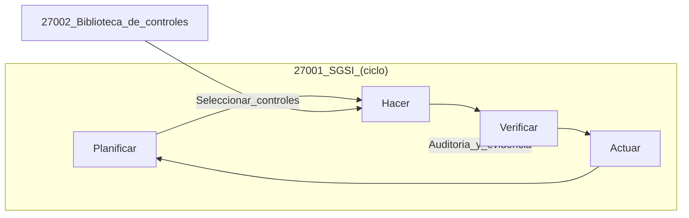

# Introducción a normas ISO: qué es una ISO, ISO/IEC 27001 y 27002

## Objetivos de aprendizaje

- Explicar qué es una norma ISO en términos sencillos y para qué sirve.
- Diferenciar ISO/IEC 27001 (sistema de gestión) vs 27002 (controles) en 2 frases.
- Nombrar 6 temas típicos de controles (acceso, incidentes, criptografía, etc.).
- Relacionar “cumplimiento” con “reducción de riesgo” sin confundirlos.
- Proponer 3 evidencias que demostrarían madurez de seguridad en un equipo.

## Prerrequisitos

Conocer qué es una política, un proceso y un control (en sentido general).

## Qué es una ISO

Una ISO es una norma publicada por la Organización Internacional de Normalización. En la práctica, una norma define “qué se espera” y “cómo demostrarlo” para lograr consistencia, calidad y confianza entre organizaciones. No es un software ni un firewall: es una guía/estándar para organizar trabajo y evidencias.

## ISO/IEC 27001 vs ISO/IEC 27002

### ISO/IEC 27001 (el sistema)

27001 se enfoca en el Sistema de Gestión de Seguridad de la Información (SGSI): políticas, roles, evaluación de riesgos, mejora continua y auditoría. Es “cómo gestionas la seguridad” como proceso organizacional.

### ISO/IEC 27002 (los controles)

27002 es un catálogo de controles y buenas prácticas. Es “qué controles puedes aplicar” para tratar riesgos: acceso, criptografía, operaciones, proveedores, incidentes, etc.

### Idea clave

27001 te pide gobernar; 27002 te sugiere controles. Puedes usar controles sin certificarte, y puedes “cumplir” papeles sin reducir riesgo si no los ejecutas bien.

## Ejemplo real (historia)

Historia: “La auditoría que sí ayudó”. Una empresa tuvo incidentes repetidos por accesos compartidos. En vez de comprar otra herramienta, definió roles, revisiones periódicas y un proceso de baja de usuarios. Usó controles tipo 27002 (gestión de acceso) y lo integró al ciclo de trabajo (estilo 27001). El resultado fue simple: menos cuentas huérfanas, menos sorpresas, y evidencia clara cuando algo pasaba.

## Ejemplo técnico (qué evidencias pedirías)

Si tuvieras que evaluar seguridad con lente ISO, pedirías evidencias: inventario de activos, matriz de riesgos, política de contraseñas, bitácora de accesos, procedimientos de incidentes, y registros de cambios. La evidencia importa porque convierte “yo creo” en “yo demuestro”.

```json
{
  "control_id": "AC-01",
  "objetivo": "Asegurar que los accesos sean autorizados y revisados.",
  "evidencia": "Reporte mensual de usuarios y roles + registro de aprobaciones.",
  "frecuencia": "mensual",
  "dueno": "security_lead",
  "ultimo_resultado": "ok"
}
```

## Diagrama (Mermaid)

### Relación 27001–27002



## Reto interactivo (sin código)

Escribe 3 controles que implementarías en un equipo pequeño (menos de 5 personas) y para cada uno define: “qué evidencia quedará” y “cada cuánto se revisa”.

## Mini-quiz (5 preguntas)

1. V/F: Una norma ISO es una herramienta de software que se instala.
2. V/F: ISO/IEC 27001 se centra en gestionar seguridad como un sistema.
3. 27002 es principalmente:
4. “Evidencia” en un control significa:
5. En 1 frase, di la diferencia entre “cumplir” y “reducir riesgo”.

- A) Catálogo de controles
- B) Lenguaje de programación
- C) Certificado de servidor

- A) Opinión del equipo
- B) Prueba verificable
- C) Un enlace a una noticia

Respuestas: (1) F, (2) V, (3) A, (4) B, (5) Respuesta esperada: cumplimiento puede ser documental; reducir riesgo es que los controles funcionen y bajen probabilidad/impacto.
