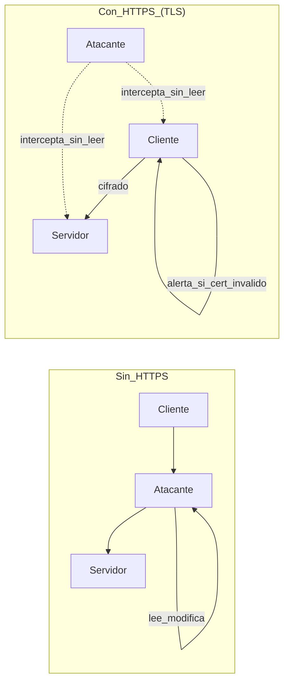

# HTTPS y ataques MITM: qué protege y qué no

## Objetivos de aprendizaje

- Explicar en términos simples qué aporta HTTPS a CIA + Autenticidad.
- Describir un escenario MITM y cómo HTTPS lo dificulta.
- Identificar 4 errores comunes al “usar HTTPS” sin estar realmente seguro.
- Reconocer qué HTTPS NO soluciona (ej. SQLi, credenciales débiles).
- Proponer prácticas de configuración y verificación (sin entrar a comandos avanzados).

## Prerrequisitos

Saber qué es un navegador, un dominio y una red Wi‑Fi.

## Qué es HTTPS

HTTPS es HTTP sobre una conexión cifrada y autenticada (TLS). En práctica: evita que terceros lean o modifiquen el tráfico en tránsito, y ayuda a comprobar que hablas con el servidor correcto (según certificados).

## MITM (Man‑in‑the‑Middle) explicado

En un MITM, un tercero se ubica entre tu navegador y el servidor. Intenta espiar o alterar el tráfico: robar credenciales, cambiar contenido o redirigir pagos. Sin HTTPS, el atacante “ve” todo. Con HTTPS bien configurado, el atacante no puede leer ni modificar sin ser detectado.

## Qué no soluciona HTTPS

- No arregla vulnerabilidades del servidor (SQLi, XSS, lógica).
- No evita que uses contraseñas débiles o repetidas.
- No evita que un atacante entre con credenciales reales robadas.
- No impide que tu app registre secretos en logs.
- No sustituye autorización: HTTPS no decide permisos.

## Ejemplo real (historia)

Historia: “El Wi‑Fi del aeropuerto”. Una persona abre un portal de viajes en Wi‑Fi público. Una red falsa con nombre similar captura tráfico. Si el sitio no fuerza HTTPS, el atacante ve credenciales. Si el sitio usa HTTPS correctamente, el atacante solo ve “ruido” cifrado y el navegador advierte si el certificado no coincide.

## Ejemplo técnico (qué revisarías)

A nivel de app, revisas que todo el sitio cargue por HTTPS, que no haya recursos mixtos (HTTP dentro de HTTPS), que las cookies de sesión tengan bandera Secure, y que el servidor redirija HTTP→HTTPS. También revisas que el usuario reciba errores genéricos y no pistas internas.

```http
GET / HTTP/1.1
Host: ejemplo.com

HTTP/1.1 301 Moved Permanently
Location: https://ejemplo.com/

GET / HTTP/1.1
Host: ejemplo.com

HTTP/1.1 200 OK
Strict-Transport-Security: max-age=31536000; includeSubDomains
Content-Type: text/html; charset=utf-8
```

## Diagrama (Mermaid)

### Tráfico sin HTTPS vs con HTTPS



## Reto interactivo (sin código)

Escribe 3 cosas que HTTPS protege y 3 cosas que no protege. Debes incluir al menos una de: integridad, confidencialidad, autenticidad.

## Mini-quiz (5 preguntas)

1. V/F: HTTPS evita que un atacante lea el tráfico en tránsito.
2. V/F: HTTPS por sí solo evita SQL Injection.
3. MITM significa:
4. Un error común es:
5. En 1 frase, di qué aporta HTTPS a “autenticidad”.

- A) Ataque al servidor con fuerza bruta
- B) Intermediario entre cliente y servidor
- C) Copiar base de datos

- A) Forzar redirección a HTTPS
- B) Permitir recursos HTTP mixtos
- C) Usar cookies Secure

Respuestas: (1) V, (2) F, (3) B, (4) B, (5) Respuesta esperada: valida (por certificados) que hablas con el servidor esperado y reduce suplantación en tránsito.
