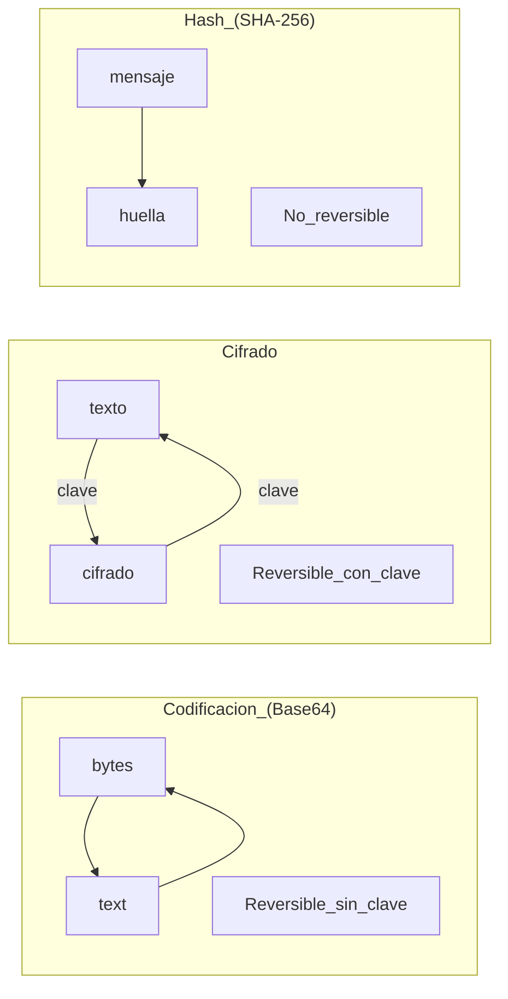

# Base64: codificación/decodificación y malentendidos frecuentes

## Objetivos de aprendizaje

- Definir Base64 como codificación, no como seguridad.
- Describir 3 casos válidos de uso (transporte, compatibilidad, blobs).
- Detectar 3 errores comunes (usar Base64 como “cifrado”).
- Explicar la diferencia entre codificación, cifrado y hash con 1 ejemplo cada uno.
- Proponer una regla para manejo de secretos: “si está en Base64, no está protegido”.

## Prerrequisitos

Entender que datos pueden representarse como texto para enviarse por red.

## Qué es Base64

Base64 es una codificación: transforma bytes en caracteres imprimibles para poder transportar datos en sistemas que esperan texto. No agrega confidencialidad. Si alguien obtiene el Base64, puede decodificarlo.

## Cuándo sí usar Base64

- Enviar datos binarios en JSON o texto (ej. pequeños adjuntos).
- Evitar problemas de compatibilidad con caracteres.
- Representar tokens o blobs de forma transportable (sin prometer seguridad).

## Cuándo NO usar Base64

- Para “ocultar” contraseñas o secretos.
- Para “cifrar” información sensible.
- Para cumplir seguridad o privacidad.
- Como sustituto de TLS/HTTPS.

## Ejemplo real (historia)

Historia: “La contraseña ‘protegida’”. Un equipo guarda contraseñas en Base64 en un archivo porque “no se ven”. Un día el archivo se filtra. Un atacante decodifica en segundos. El problema no fue Base64: fue confundir codificación con protección.

## Ejemplo técnico (demostración conceptual)

La demostración debe mostrar un texto original, su representación en Base64 y la decodificación de vuelta al original, para que quede claro que no hay seguridad. Luego debe contrastar con un ejemplo de hash (irreversible) y cifrado (reversible con clave), sin implementar algoritmos, solo con la idea.

```bash
# Base64 codifica/decodifica (ejemplo conceptual)
echo -n "hola" | base64
echo -n "aG9sYQ==" | base64 -d
```

```json
{
  "config_insegura": {
    "db_password_base64": "c2VjcmV0MTIz"
  },
  "config_mejor": {
    "db_password_env": "DB_PASSWORD"
  }
}
```

## Diagrama (Mermaid)

### Codificación vs cifrado vs hash



## Reto interactivo (sin código)

Escribe 3 frases: una para explicar Base64 a alguien no técnico, otra para corregir el error “Base64 = cifrado”, y otra para proponer qué hacer con secretos en vez de Base64.

## Mini-quiz (5 preguntas)

1. V/F: Base64 agrega confidencialidad a los datos.
2. V/F: Base64 sirve para transportar bytes como texto.
3. Base64 es:
4. Guardar secretos en Base64 es:
5. En 1 frase, explica por qué Base64 no es seguridad.

- A) Hash
- B) Cifrado
- C) Codificación

- A) Seguro
- B) Inseguro
- C) Recomendado por ISO

Respuestas: (1) F, (2) V, (3) C, (4) B, (5) Respuesta esperada: es reversible sin clave; cualquiera que lo obtenga puede decodificar.
