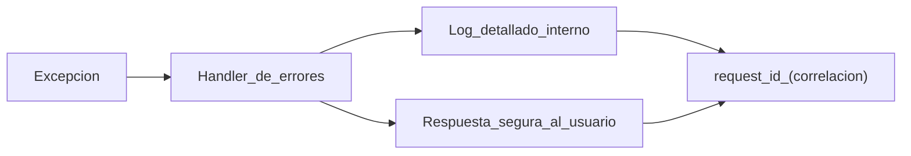

# Programación segura: excepciones, logs y configuración sensible con JSON (PHP)

## Objetivos de aprendizaje

- Aplicar 6 reglas de programación segura en endpoints y lógica de negocio.
- Diseñar manejo de excepciones por capas (presentación vs dominio vs infraestructura).
- Redactar mensajes de error seguros: usuario vs log interno.
- Definir qué registrar en logs (y qué nunca) con 8 ejemplos.
- Proponer una estructura JSON de configuración sin secretos embebidos.
- Explicar por qué “más logs” no siempre es mejor sin disciplina.

## Prerrequisitos

Conocer conceptos básicos de backend y tener noción de PHP como tecnología (sin requerir escribir código aquí).

## Programación segura (reglas prácticas)

Programar seguro es reducir sorpresa. Tu código debe ser predecible ante entradas malas, fallos de red, errores de base de datos y abuso. No es paranoia: es diseño para el mundo real.

- Validar entradas por tipo/longitud/formato en servidor.
- Aplicar autorización en cada acción, no solo en “pantallas”.
- No confiar en el cliente para decisiones críticas.
- Usar dependencias actualizadas y evitar “copiar y pegar” código de origen dudoso.
- Tratar errores como eventos esperables: manejar y registrar.
- Limitar intentos y velocidad en acciones sensibles (rate limiting).
- Separar ambientes (dev/test/prod) y no mezclar configuraciones.
- Revisar secretos: nunca en repositorio, nunca en logs.

## Manejo de excepciones por capa (PHP)

Una excepción no debería “reventar” al usuario con detalles internos. La app debe capturar errores, devolver mensajes seguros y mantener un identificador para rastreo. En capas: la capa de aplicación traduce errores a respuestas; la capa de dominio expresa reglas; la infraestructura captura fallos técnicos (BD/red).

```php
<?php
// Ejemplo conceptual: controlador captura excepción y responde seguro.
// - El usuario recibe un mensaje genérico.
// - El log interno guarda el detalle con request_id.
// (Ajusta a tu framework: Laravel/Symfony/plain PHP.)
?>
```

## Logs de aplicación (PHP): útiles, mínimos, seguros

Un log es evidencia. Debe permitir responder: qué pasó, cuándo, a quién afectó, desde dónde, y con qué resultado. Pero un log también puede ser una fuga si guarda contraseñas, tokens, números completos de tarjeta o datos sensibles sin necesidad.

### Qué sí registrar

- request_id
- user_id (si aplica)
- endpoint
- método
- ip
- resultado
- tiempo de respuesta
- evento de seguridad (login, cambio de contraseña, permisos)

### Qué nunca registrar

- contraseñas
- tokens completos
- códigos 2FA
- secret keys
- datos sensibles completos (documento, tarjeta)
- payloads completos sin enmascarar

```json
{
  "log_correcto": {
    "event": "login_failed",
    "request_id": "req_91b6c8",
    "user_id": null,
    "ip": "203.0.113.9",
    "result": "denied",
    "reason": "invalid_credentials",
    "email_masked": "j***@example.com"
  },
  "log_incorrecto": {
    "event": "login_failed",
    "password": "PlainTextPassword123!",
    "token": "FULL_JWT_OR_SESSION_TOKEN"
  },
  "por_que_es_incorrecto": "Guarda secretos/credenciales y puede convertirse en fuga de datos."
}
```

## Configuración y almacenamiento de info sensible con JSON

JSON sirve para configuración, no para secretos. Buenas prácticas: separar configuración pública (features, endpoints, flags) de secretos (claves, passwords) que deben venir de un gestor de secretos o variables de entorno. Si debes usar JSON, usa referencias (nombres de variables) y evita valores sensibles reales.

```json
{
  "app": { "env": "production" },
  "db": {
    "host": "db.internal",
    "name": "app",
    "user": "app_user",
    "password_env": "DB_PASSWORD"
  },
  "jwt": {
    "signing_key_env": "JWT_SIGNING_KEY",
    "ttl_seconds": 3600
  }
}
```

## Ejemplo real (historia)

Historia: “El error que filtró todo”. En producción, una app muestra un stack trace completo cuando falla una consulta. Ese error incluye rutas del servidor y fragmentos de la consulta. Un atacante aprende la estructura interna y acelera ataques. Con manejo correcto, el usuario vería “Ocurrió un problema, intenta más tarde”, y el equipo vería el detalle en logs internos con request_id.

## Diagrama (Mermaid)

### Errores: usuario vs observabilidad interna



## Reto interactivo (sin código)

Escribe 6 mensajes de error seguros (para usuario) para: login fallido, permiso denegado, validación inválida, servidor caído, pago rechazado, archivo no permitido. Luego escribe qué se registraría internamente (sin secretos) para cada caso.

## Mini-quiz (5 preguntas)

1. V/F: Es buena práctica mostrar stack traces en producción para depurar más rápido.
2. V/F: Los logs pueden ser un riesgo si almacenan secretos.
3. Un mensaje seguro al usuario debe ser:
4. En JSON de config, lo recomendado para secretos es:
5. En 1 frase, ¿por qué necesitas un request_id?

- A) Detallado con rutas internas
- B) Genérico y claro
- C) Con consulta SQL completa

- A) Guardarlos en Base64
- B) Guardarlos como texto plano
- C) Referenciarlos y obtenerlos de un sistema seguro

Respuestas: (1) F, (2) V, (3) B, (4) C, (5) Respuesta esperada: para correlacionar error visible con evidencia interna sin filtrar detalles al usuario.
