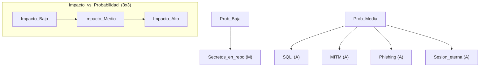

# Matriz de riesgos: cómo priorizar controles y justificar decisiones

## Objetivos de aprendizaje

- Definir activo, amenaza, vulnerabilidad, impacto y probabilidad con un ejemplo.
- Construir una matriz 3x3 (bajo/medio/alto) con 6 riesgos de una app web.
- Priorizar 3 mitigaciones que den mayor reducción de riesgo por esfuerzo.
- Relacionar riesgos con controles (ISO/IEC 27002 como referencia conceptual).
- Redactar una justificación corta de decisión (“aceptar, mitigar, transferir, evitar”).
- Detectar duplicados: mismo riesgo con diferentes síntomas.

## Prerrequisitos

Haber visto al menos una vulnerabilidad (phishing, MITM o SQLi) en lecciones previas.

## Conceptos base (con ejemplo simple)

Activo: lo que te importa (datos, dinero, reputación). Amenaza: lo que podría pasar (robo, fraude, caída). Vulnerabilidad: debilidad que permite (inputs sin validar, sesiones eternas). Impacto: cuánto duele si ocurre. Probabilidad: qué tan fácil o frecuente es. Riesgo: combinación de impacto y probabilidad.

## Cómo usar la matriz

La matriz no predice el futuro: ordena conversaciones. Sirve para decidir qué haces primero. En equipos pequeños, lo correcto es empezar por controles que reducen mucho riesgo con poco costo: parametrización SQL, cookies seguras, expiración, manejo de errores, gestión de secretos, y monitoreo básico.

## Ejemplo real (historia)

Historia: “El presupuesto no alcanza”. El equipo tiene 2 semanas para mejorar seguridad. Hay 20 ideas. Sin priorización, eligen “lo más llamativo”. Con matriz, ven que SQLi y sesión eterna tienen probabilidad alta e impacto alto. Deciden mitigar esos primero, y posponen mejoras cosméticas. El resultado: menos riesgo real y mejor argumento ante stakeholders.

## Ejemplo técnico (matriz simple)

Debe incluir una tabla (texto) con al menos 6 riesgos, cada uno con: activo, amenaza, vulnerabilidad, impacto (B/M/A), probabilidad (B/M/A), nivel (B/M/A), decisión (mitigar/aceptar/etc.) y control propuesto.

| Riesgo | Activo | Amenaza | Vulnerabilidad | Impacto | Probabilidad | Nivel | Decisión | Control propuesto |
|---|---|---|---|---|---|---|---|---|
| SQLi en buscador | Datos de usuarios | Extracción/alteración | SQL concatenado | A | M | A | Mitigar | Parametrización + mínimo privilegio |
| MITM en red pública | Credenciales/sesión | Interceptación | No forzar HTTPS | A | M | A | Mitigar | HTTPS + HSTS + cookies Secure |
| Phishing a soporte | Cuentas admin | Suplantación | Falta de verificación | A | M | A | Mitigar | Proceso out-of-band + 2FA |
| Sesión eterna | Privacidad | Acceso no autorizado | Tokens sin exp | A | M | A | Mitigar | Expiración + rotación + logout |
| Errores con stack trace | Infraestructura | Reconocimiento | Manejo de errores débil | M | M | M | Mitigar | Error handler + mensajes seguros |
| Secretos en repo | Claves y tokens | Exfiltración | Config con secretos | A | B | M | Mitigar | Secret manager + rotación |

```json
{
  "risk_id": "R-001",
  "asset": "user_data",
  "threat": "data_exfiltration",
  "vulnerability": "sql_concatenation_in_search",
  "impact": "A",
  "probability": "M",
  "level": "A",
  "decision": "mitigate",
  "control": "prepared_statements_and_least_privilege"
}
```

## Diagrama (Mermaid)

### Mapa de calor 3x3 (conceptual)



## Reto interactivo (sin código)

Construye tu matriz 3x3 con 6 riesgos de una app (puede ser imaginaria). Debes incluir al menos: SQLi, MITM, phishing, y manejo de secretos. Luego elige 3 mitigaciones “primero” y explica en 2 líneas por qué.

## Mini-quiz (5 preguntas)

1. V/F: Riesgo depende de impacto y probabilidad.
2. V/F: Si algo tiene impacto alto pero probabilidad baja, siempre se ignora.
3. Una “vulnerabilidad” es:
4. Una decisión “mitigar” significa:
5. En 1 frase, ¿para qué sirve una matriz de riesgos en un equipo pequeño?

- A) Lo que te importa
- B) Debilidad explotable
- C) El daño final

- A) No hacer nada
- B) Reducir probabilidad/impacto con controles
- C) Publicar el riesgo

Respuestas: (1) V, (2) F, (3) B, (4) B, (5) Respuesta esperada: priorizar trabajo y justificar decisiones con criterio (impacto/probabilidad).
